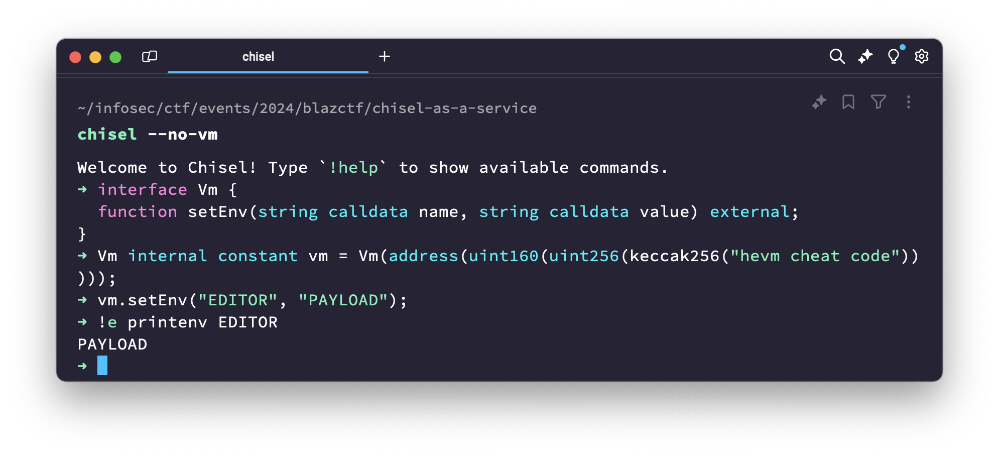
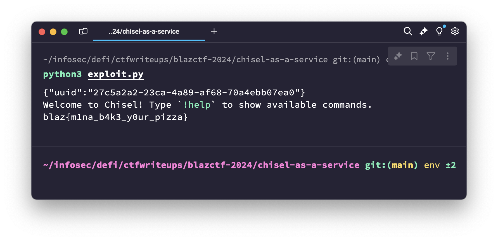

# Chisel as a Service

> [!NOTE]  
> Medium | 25 solves  
> Source: https://github.com/fuzzland/blazctf-2024/tree/main/chisel-as-a-service

As mentioned in the challenge name and description, this challenge of BlazCTF 2024 exposed a usable
chisel REPL (https://book.getfoundry.sh/chisel/) instance with which the player could interact with.
Chisel itself is a tool for local debugging of Solidity snippets, meaning it wasn't really meant to be exposed to an untrusted party,
which the challenge sources tried to overcome by performing some command sanitization on the incoming input.

> Mina just develops a highly robust Solidity sandbox!

## TLDR

We are given access to the chisel Solidity REPL, but it is restricted using the `--no-vm` flag, and our input to it is filtered to disallow usage of the `!exec` command.
`--no-vm` can be bypassed by manually calculating the address of the `Vm` cheatcode contract,
at which point it can be used to set the `EDITOR` environment variable to `bash` via the `setEnv` cheatcode.
Calling the `!edit` command then opens the session REPL code in `bash`,
allowing us to use `//bin/cat` as input to the REPL, which will be interpreted as a comment in Solidity,
in order to read the contents of the flag file.

## Analysis

### Understanding the challenge

The main entrypoint for the challenge which we are given is the `index.js` file
with a single `/run` endpoint:

```js
app.get("/run", async (req, res) => {
  try {
    // Sanitization
    const code = String(req.query.code);
    if (/^[\x20-\x7E\r\n]*$/.test(code) === false)
      throw new Error("Invalid characters");
    const commands = code.toLowerCase().match(/![a-z]+/g);
    if (
      commands !== null &&
      (commands.includes("!exec") || commands.includes("!e"))
    )
      throw new Error("!exec is not allowed");

    // Execution using zx.$
    const uuid = crypto.randomUUID();
    await $({
      cwd: "public/out",
      timeout: "3s",
      input: code,
    })`chisel --no-vm > ${uuid}`;
    res.send({ uuid });
  } catch (e) {
    console.log(e);
    res.status(500).send("error");
  }
});
```

`/run` checks for the presence of `!exec` or `!e` "commands" in the input,
which it matches using the regex "exclamation mark and then any sequence of lowercase letters",
and non-printable characters, in both cases throwing an error.
It then runs chisel with the "validated" input code using zx (https://www.npmjs.com/package/zx),
redirecting the output to a random file in the `public/out` directory, additionally specifying a `--no-vm` flag. Disecting the limitations imposed:

1. `!exec` and `!e` are filtered out. Running `!help` in chisel shows that
   these commands allow local command execution:

   > `!exec <command> [args]` | `!e <command> [args]` - Execute a shell command and print the output

   Considering this, one of the possible ways to solve the challenge would to
   find a way to bypass the filter, or somehow leverage some other chisel commands.

2. `--no-vm` in `chisel --help` is specified as follows:

   > Disable the default `Vm` import.

   `Vm` is a default import provided by forge (https://book.getfoundry.sh/forge/cheatcodes), which is used by chisel for running the REPL prompts,
   and provides so called "cheatcodes" to access additional data from Solidity forge scripts,
   such as environment variables and local files, and manipulate the state of the EVM.
   Gaining access to these cheatcodes might also be useful for solving the challenge.

Before we try to find ways to bypass the restrictions implemented by the challenge,
it is crucial to understand our goal. What do we need to do in order to get the flag?
Looking for mentions of the string "flag" in the sources, we can see it being copied
to a semi-random file in the root directory in the `Dockerfile`:

```docker
RUN mv flag.txt /flag-$(md5sum flag.txt | cut -c-32).txt
```

Since there's no reasonable way to guess the MD5 hash of the flag without actually knowing it,
we need to be able to perform two actions in order to solve the challenge:

1. List the contents of directories, or at least partially leak the names of files;
2. Read the contents of files.

### Looking for a solution

A good strategy for such "sandbox" tasks where some restrictions are imposed
on user input which is then executed in some environment is to try to understand
the possible solutions which would be available without the restrictions.
In the case of chisel, as it is known from the challenge, we have access to two
interesting interfaces providing additional functionality on top of the basic Solidity REPL:
chisel commands, and forge `Vm` cheatcodes.

If we look through the commands listed in chisel if we run `!help`,
these commands seem interesting as they interact with external resources (file, network):

- > `!load <id>` | `!l <id>` - Load a previous session ID from cache
- > `!list` | `!ls` - List all cached sessions
- > `!export` | `!ex` - Export the current session source to a script file
- > `!fetch <addr> <name>` | `!fe <addr> <name>` - Fetch the interface of a verified contract on Etherscan
- > `!edit` - Open the current session in an editor

`!load`, `!ls` might work if the sessions are stored in local files and we can
somehow override the path used for these sessions. `!export` might work if we can
then somehow execute the generated script without the sandbox restrictions.
`!fetch` might work if it for some reasons allows specifying a `file://` URL
override instead of the default Etherscan URL. Out of all of these commands,
however, `!edit` seems to be the most useful, as it actually opens the currently
saved REPL inputs in the current user's editor, such as `vim` or `nano`.
If we additionally check the commands specified in chisel's actual source code,
we can just confirm that there aren't any which aren't specified in the `!help` info ([foundry-rs/foundry/crates/chisel/src/cmd.rs#L12](https://github.com/foundry-rs/foundry/blob/25f24e677a6a32a62512ad4f561995589ac2c7dc/crates/chisel/src/cmd.rs#L12)):

```rust
pub enum ChiselCommand {
    Help,
    Quit,
    Clear,
    Source,
    Save,
    Load,
    ListSessions,
    ClearCache,
    Fork,
    Traces,
    Calldata,
    MemDump,
    StackDump,
    Export,
    Fetch,
    Exec,
    RawStack,
    Edit,
}
```

To actually check what can be done using the `!edit` command, we can try building the
`Dockerfile` provided with the challenge and running chisel inside it:

```bash
> docker exec -ti caas /bin/bash

I have no name!@6e28a4fe06ee:/app$ chisel
Welcome to Chisel! Type `!help` to show available commands.
➜ !edit
Editor exited without a status code
```

Hmm. It seems like chisel can't actually open an editor, probably because a default one
isn't available in the Docker container. We can read through the chisel source code to
find out how it actually executes the `!edit` command ([foundry-rs/foundry/crates/chisel/src/dispatcher.rs#L637](https://github.com/foundry-rs/foundry/blob/25f24e677a6a32a62512ad4f561995589ac2c7dc/crates/chisel/src/dispatcher.rs#L637)):

```rust
ChiselCommand::Edit => {
    // create a temp file with the content of the run code
    let mut temp_file_path = std::env::temp_dir();
    temp_file_path.push("chisel-tmp.sol");
    let result = std::fs::File::create(&temp_file_path)
        .map(|mut file| file.write_all(self.source().run_code.as_bytes()));
    if let Err(e) = result {
        return DispatchResult::CommandFailed(format!(
            "Could not write to a temporary file: {e}"
        ))
    }

    ...
```

First, it copies the current REPL code to a temporary file in the default temp directory
(probably `/tmp` in the Docker container), and then it passes this file to the editor:

```rust
let editor = std::env::var("EDITOR").unwrap_or_else(|_| "vim".to_string());
let mut cmd = Command::new(editor);
cmd.arg(&temp_file_path);

match cmd.status() {
  ...
```

Aha! Since the `EDITOR` variable is empty in the Docker container (which can be confirmed
from the output of `printenv`), chisel tries to open `vim`, but fails, since it is not
installed in the container. If we recall the `Vm` cheatcodes which are disabled by the
challenge, we can look through the ones available in forge ([foundry-rs/forge-std/src/Vm.sol](https://github.com/foundry-rs/forge-std/blob/8f24d6b04c92975e0795b5868aa0d783251cdeaa/src/Vm.sol)) and see that there is a cheatcode which allows setting our own environment variables:

```solidity
/// Sets environment variables.
function setEnv(string calldata name, string calldata value) external;
```

Now, if we can somehow get access to the `Vm` cheatcodes, we can use `setEnv` to set
the value of `EDITOR` to some other program which will be executed instead of `vim`.
For example, `bash`! Doing so will pass the temporary file containing the code
we entered into the REPL to `bash`, which will then gladly execute the commands it finds inside. Lets see how `--no-vm` actually works and disables the `Vm` import,
and maybe we can find a way to bypass it. If `--no-vm` isn't present, chisel prefixes
the REPL source with such code:

```rust
let script_import =
    if !config.no_vm { "import {Script} from \"forge-std/Script.sol\";\n" } else { "" };
```

Looking through `forge-std/Script.sol` (https://github.com/foundry-rs/forge-std/blob/8f24d6b04c92975e0795b5868aa0d783251cdeaa/src/Script.sol) and how its implemented,
we can find that `vm` is defined in `forge-std/Base.sol` (https://github.com/foundry-rs/forge-std/blob/8f24d6b04c92975e0795b5868aa0d783251cdeaa/src/Base.sol#L27):

```solidity
address internal constant VM_ADDRESS = address(uint160(uint256(keccak256("hevm cheat code"))));

...

Vm internal constant vm = Vm(VM_ADDRESS);
```

And it doesn't seem like such an address is disabled anywhere in chisel if `--no-vm` is specified... If we try calling `setEnv` on this address, it actually works!



## Solution

Combining the ability to actually access the `Vm` cheatcodes with the functionality
of specifying our own EDITOR for `!edit`, which isn't banned by the challenge,
we can come up with the following input to be submitted to the `/run` endpoint:

```
//bin/cat /flag*txt

interface Vm {
  function setEnv(string calldata name, string calldata value) external;
}

Vm internal constant vm = Vm(address(uint160(uint256(keccak256("hevm cheat code")))));

vm.setEnv("EDITOR", "bash");
!edit
```

`//bin/cat /flag*txt` will be interpreted by chisel as a Solidity comment and ignored
until we call `!edit`, which will pass our input to `bash`, at which point
`//bin/cat` will be interpreted as part of a bash script and executed.

[./exploit.py](./exploit.py) contains a complete automated POC to solve the challenge.
As a conclusion, do not use debug utilities such as REPLs in ways they were not meant to be used unless you want your flags to be leaked 🚩


