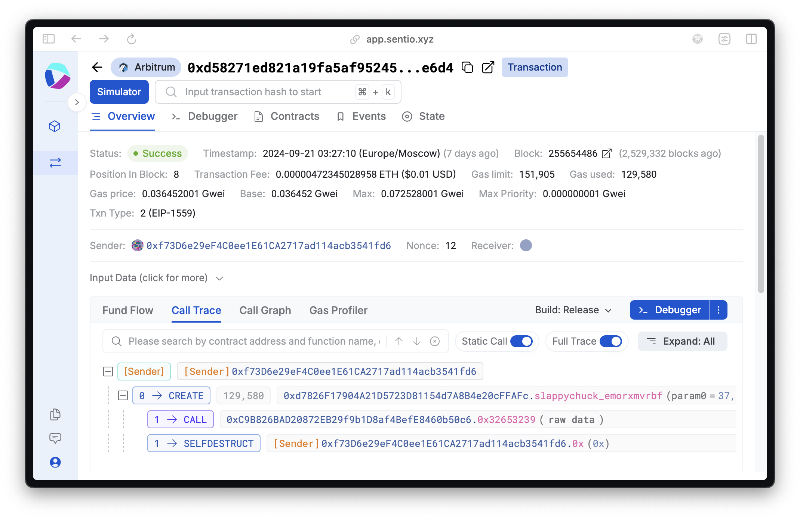
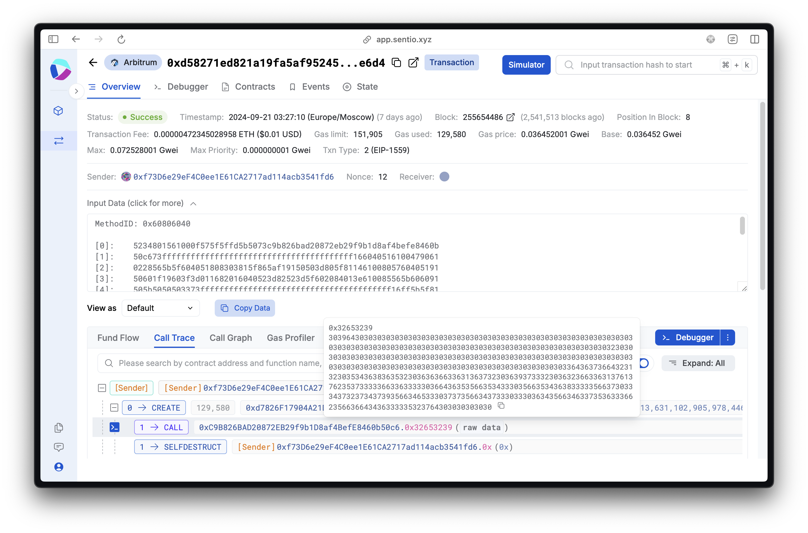
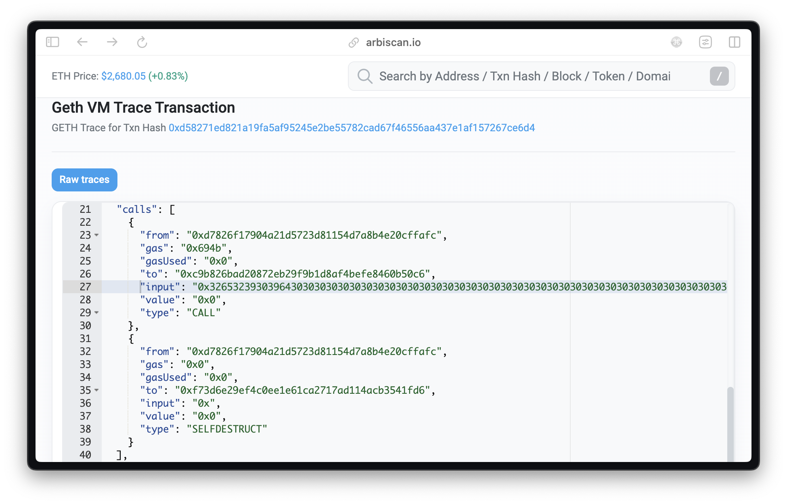
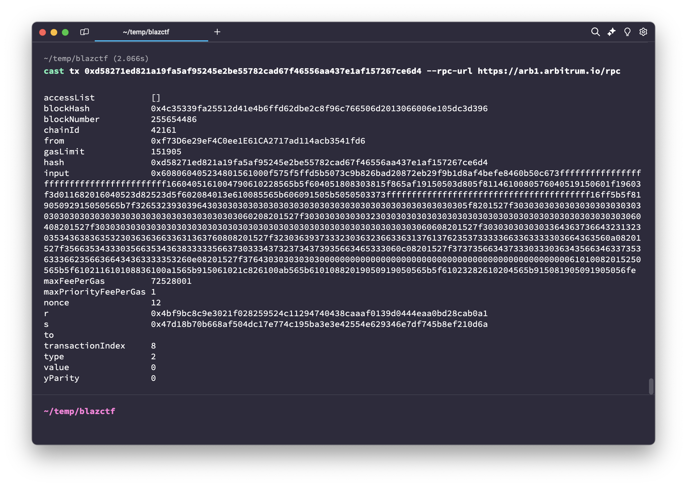
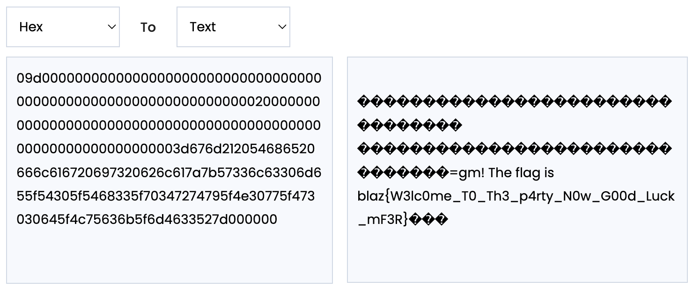

# Ciao 👋

> [!NOTE]
> \[🟢]&ensp;**WELCOME**:&emsp;`193` solves

Ciao is a **welcome** challenge released at the very beginning of the **BlazCTF**. This is a textbook example of a **sanity check** CTF task. Its description implies that participants must look closely at the given transaction to discover _a hidden treasure_.<br />

\+ \[💡\]&ensp;A hint* added to the description states that participants should have a look specifically at the **calls** within the transaction, with the use of an _explorer_.

> Tony, a web3 whiz, scoured blockchain transactions for hidden treasures. His diligence struck gold when he uncovered [a lucrative transaction](https://arbiscan.io/tx/0xd58271ed821a19fa5af95245e2be55782cad67f46556aa437e1af157267ce6d4) others had overlooked.<br />
> 
> *Hint: [Try Sentio Explorer and see what is called!](https://app.sentio.xyz/tx/42161/0xd58271ed821a19fa5af95245e2be55782cad67f46556aa437e1af157267ce6d4)

<br />

## 📑&ensp;TLDR
The transaction has input data appended to it. This data is a hexadecimal string that may be converted to text, which contains the flag.

## 🔍&ensp;Analysis

The given transaction has a `TxHash` of `0xd58271ed821a19fa5af95245e2be55782cad67f46556aa437e1af157267ce6d4` and is located within **Arbitrum** chains — a technology based on Ethereum.

> \[🔗\]&ensp;Arbitrum Docs:&emsp;[docs.arbitrum.io](https://docs.arbitrum.io/welcome/arbitrum-gentle-introduction)

<br />

> [!TIP]
> In order to look closely at the transaction, one can use a variety of tools, from _online explorers_ to _command line programs_.<br />
>
> Here is a list of examples of tools that might help solve this challenge:
> - **Arbiscan** (_from the task description_):&emsp;[arbiscan.io](https://arbiscan.io/)&emsp;|&ensp;[`transaction`](https://arbiscan.io/tx/0xd58271ed821a19fa5af95245e2be55782cad67f46556aa437e1af157267ce6d4)
> - **Sentio Explorer** (_from the hint*_):&emsp;[app.sentio.xyz](https://app.sentio.xyz/)&emsp;|&ensp;[`transaction`](https://app.sentio.xyz/tx/42161/0xd58271ed821a19fa5af95245e2be55782cad67f46556aa437e1af157267ce6d4)
> - **Tenderly Explorer**:&emsp;[dashboard.tenderly.co](https://dashboard.tenderly.co/explorer)&emsp;|&ensp;[`transaction`](https://dashboard.tenderly.co/tx/arbitrum/0xd58271ed821a19fa5af95245e2be55782cad67f46556aa437e1af157267ce6d4)
> - **3xpl**:&emsp;[3xpl.com](https://3xpl.com/)&emsp;|&ensp;[`transaction`](https://3xpl.com/arbitrum-one/transaction/0xd58271ed821a19fa5af95245e2be55782cad67f46556aa437e1af157267ce6d4)
> - **OkLink**:&emsp;[oklink.com](https://www.oklink.com/)&emsp;|&ensp;[`transaction`](https://www.oklink.com/arbitrum/tx/0xd58271ed821a19fa5af95245e2be55782cad67f46556aa437e1af157267ce6d4)
> - **Arbitrum One Explorer** by **DexGuru**:&emsp;[arbitrum.dex.guru](https://arbitrum.dex.guru/)&emsp;|&ensp;[`transaction`](https://arbitrum.dex.guru/tx/0xd58271ed821a19fa5af95245e2be55782cad67f46556aa437e1af157267ce6d4)
> - **Foundry**:&emsp; :octocat: [foundry-rs/foundry](https://github.com/foundry-rs/foundry)
> - ...

<br />

## 🔓&ensp;Solution

### Analyzing a bit more 💭

#### Online Explorer

The participant should look into the transaction with the use of any online explorer of their choice, like the ones mentioned above in the "Tip" section. In this section of the write-up, we will go through the required steps using **Sentio Explorer** and **Arbiscan**.

<br />

Once they look through the transaction **calls** and the _debug information_, such as the **call graph** and **call trace**, they might notice that transaction call trace includes the following steps:
1. `CREATE` — Creation of a child contract;
2. `CALL` — Call of a method in another contract;
3. `SELFDESTRUCT` — Destruction of the contract;

That is how it looks like in the **Sentio Explorer**'s `Call Trace` of the transaction \[[🔗](https://app.sentio.xyz/tx/42161/0xd58271ed821a19fa5af95245e2be55782cad67f46556aa437e1af157267ce6d4)\]:
<p align="center"></p>
<br />

> [!NOTE]
> **Function calls** may have data appended to it, which is called the **call data**. The call data specifies the details required to send messages to other entities, like when there is a call to an EVM smart contract and the smart contract needs to know which function it should execute and which values it should pass as arguments.
<br />

- In **Sentio Explorer**, one can look at the `Input Data` OR point at the `CALL` line to view `Call data` / `raw data`:
<p align="center"></p>

- In **Arbiscan**, one can look at the `Input Data` OR go to `Geth Debug Trace` and find a list of `calls`:
<p align="center"></p>
<br />

#### CLI Program

An alternative solution would be to look into the transaction with the use of a CLI software, such as [**Foundry**](https://github.com/foundry-rs/foundry).<br />

Upon installation, **Foundry** provides the user with `forge`, `cast`, `anvil` and `chisel` CLI tools:
- `forge` — Build / Test / Fuzz / Debug / Deploy Solidity contracts;
- `cast` — Perform Ethereum RPC calls from the CLI;
- `anvil` — Create a local testnet node for Deploying / Testing smart contracts;
- `chisel` — Test / Receive verbose feedback on Solidity inputs within a REPL environment;
<br />

So another way to get information on the transaction **input data** is to use the [`cast tx`](https://book.getfoundry.sh/reference/cast/cast-tx) command. In our case:
- `tx_hash` = `0xd58271ed821a19fa5af95245e2be55782cad67f46556aa437e1af157267ce6d4`
- `--rpc-url` = one of the [Arbitrum public RPC endpoints](https://docs.arbitrum.io/build-decentralized-apps/reference/node-providers), e.g. `https://arb1.arbitrum.io/rpc`
```bash
cast tx 0xd58271ed821a19fa5af95245e2be55782cad67f46556aa437e1af157267ce6d4 --rpc-url https://arb1.arbitrum.io/rpc
```
<p align="center"></p>
<br />

#### Python

Moreover, one can use **Python 3** and its **`web3`** library to retrieve information regarding the transaction:
> 1. Import [**`web3`** library](https://web3py.readthedocs.io/)
> 2. Specify the transaction hash&emsp;(`0xd58271ed821a19fa5af95245e2be55782cad67f46556aa437e1af157267ce6d4`)
> 3. Specify one of the [Arbitrum public RPC endpoints](https://docs.arbitrum.io/build-decentralized-apps/reference/node-providers)&emsp;(e.g. `https://arb1.arbitrum.io/rpc`)
> 4. Initialize an HTTP provider&emsp;(`Web3(Web3.HTTPProvider(arbitrum_rpc))`)
> 5. Make HTTP provider get the transaction&emsp;(`w3.eth.get_transaction(trx_hash)`)
<br />

Here is an example of a script that returns information about the transaction:
```python
from web3 import Web3

trx_hash     = "0xd58271ed821a19fa5af95245e2be55782cad67f46556aa437e1af157267ce6d4"
arbitrum_rpc = "https://arb1.arbitrum.io/rpc"       # One of the Arbitrum public RPC endpoints

w3 = Web3(Web3.HTTPProvider(arbitrum_rpc))
trx = w3.eth.get_transaction(trx_hash)

print(  "[*] Transaction:\n", trx)                  # Print transaction information
print("\n[+] Input Data:\n", trx["input"])          # Print transaction Input Data
```

<p align="center"></p>
<br />

### Capturing the flag 🚩

1. The data appended to the `CALL` is this hexadecimal string:
```
0x32653239303964303030303030303030303030303030303030303030303030303030303030303030
3030303030303030303030303030303030303030303030303030303030303230303030303030303030
3030303030303030303030303030303030303030303030303030303030303030303030303030303030
3030303030303030303030303364363736643231323035343638363532303636366336313637323036
3937333230363236633631376137623537333336633633333036643635356635343330356635343638
3333356637303334373237343739356634653330373735663437333033303634356634633735363336
62356636643436333335323764303030303030
```

> [!NOTE]
> The first **4 bytes** in **call data** is a **function signature** that represents the function that needs to be executed, and the following bytes are the values of its parameters.<br />
>
> So, in this case:
> - **Function signature**:&ensp;`32 65 32 39`
> - **Values**:&ensp;`3039643030303030303030303030303030303030303030303030303030303030303030303030303030303030303030303030303030303030303030303030303030303230303030303030303030303030303030303030303030303030303030303030303030303030303030303030303030303030303030303030303030303030303033643637366432313230353436383635323036363663363136373230363937333230363236633631376137623537333336633633333036643635356635343330356635343638333335663730333437323734373935663465333037373566343733303330363435663463373536333662356636643436333335323764303030303030`

2. Decoded, the value turns out to be another hexadecimal string:
```
09d0000000000000000000000000000000000000000000000000000000000000002000000000000000
0000000000000000000000000000000000000000000000003d676d212054686520666c616720697320
626c617a7b57336c63306d655f54305f5468335f70347274795f4e30775f473030645f4c75636b5f6d
4633527d000000
```

3. After another round of decoding, **the flag** is revealed!
<p align="center"></p>
<br />

> [!NOTE]
> However, if you would like to know more, let's have a look at the full raw input data appended to the transaction:
> ```
> 0x[608060405234] 801561000f575f5ffd5b5073c9b826bad20872eb29f9b1d8af4befe8460b50c67
> 3ffffffffffffffffffffffffffffffffffffffff1660405161004790610228565b5f6040518083038
> 15f865af19150503d805f8114610080576040519150601f19603f3d011682016040523d82523d5f602
> 084013e610085565b606091505b5050503373ffffffffffffffffffffffffffffffffffffffff16ff5
> b5f81905092915050565b [7f] 3265323930396430303030303030303030303030303030303030303
> 0303030305f [8201527f] 30303030303030303030303030303030303030303030303030303030303
> 030306020 [8201527f] 3030303030303230303030303030303030303030303030303030303030303
> 0306040 [8201527f] 303030303030303030303030303030303030303030303030303030303030303
> 06060 [8201527f] 30303030303033643637366432313230353436383635323036363663363136376
> 080 [8201527f] 323036393733323036323663363137613762353733333663363333303664363560a
> 0 [8201527f] 356635343330356635343638333335663730333437323734373935663465333060c0
> [8201527f] 373735663437333033303634356634633735363336623566366434363333353260e0 [8
> 201527f] 3764303030303030000000000000000000000000000000000000000000000000610100820
> 15250565b5f610211610108836100a1565b915061021c826100ab565b61010882019050919050565b5
> f61023282610204565b915081905091905056fe
> ```
> Transaction input data is also a byte code / contract initialization code, so we should treat it as such.
> - `60 80 60 40 52 34` is a **the most common beginning sequence of a contract bytecode**:&ensp;`PUSH1 0x80 PUSH1 0x40 MSTORE CALLVALUE`;
> - `82 01 52 7F` repeats several times, it is a series of opcodes:&ensp;`DUP3 ADD MSTORE PUSH32`;
> <br />
> 
> If you split the raw input data using `7F` (`PUSH32`) / `82 01 52 7F` as delimiters, you get:
> ```
> 608060405234801561000f575f5ffd5b5073c9b826bad20872eb29f9b1d8af4befe8460b50c673ffffffffffffffffffffffffffffffffffffffff1660405161004790610228565b5f604051808303815f865af19150503d805f8114610080576040519150601f19603f3d011682016040523d82523d5f602084013e610085565b606091505b5050503373ffffffffffffffffffffffffffffffffffffffff16ff5b5f81905092915050565b
> 32 65 32 39 30 39 64 30 30 30 30 30 30 30 30 30 30 30 30 30 30 30 30 30 30 30 30 30 30 30 30 30  [5f]
> 30 30 30 30 30 30 30 30 30 30 30 30 30 30 30 30 30 30 30 30 30 30 30 30 30 30 30 30 30 30 30 30  [60 20]
> 30 30 30 30 30 30 32 30 30 30 30 30 30 30 30 30 30 30 30 30 30 30 30 30 30 30 30 30 30 30 30 30  [60 40]
> 30 30 30 30 30 30 30 30 30 30 30 30 30 30 30 30 30 30 30 30 30 30 30 30 30 30 30 30 30 30 30 30  [60 60]
> 30 30 30 30 30 30 33 64 36 37 36 64 32 31 32 30 35 34 36 38 36 35 32 30 36 36 36 63 36 31 36 37  [60 80]
> 32 30 36 39 37 33 32 30 36 32 36 63 36 31 37 61 37 62 35 37 33 33 36 63 36 33 33 30 36 64 36 35  [60 a0]
> 35 66 35 34 33 30 35 66 35 34 36 38 33 33 35 66 37 30 33 34 37 32 37 34 37 39 35 66 34 65 33 30  [60 c0]
> 37 37 35 66 34 37 33 30 33 30 36 34 35 66 34 63 37 35 36 33 36 62 35 66 36 64 34 36 33 33 35 32  [60 e0]
> 37 64 30 30 30 30 30 30 00 00 00 00 00 00 00 00 00 00 00 00 00 00 00 00 00 00 00 00 00 00 00 00 00 00 00000000000108836100a1565b915061021c826100ab565b61010882019050919050565b5f61023282610204565b915081905091905056fe
> ```
> 
> - `5F` = `PUSH0`;
> - `60` = `PUSH1`;
> - `20`, `40`, `60`, `80`, `a0`, `c0`, `e0` = offsets;
> <br />
> 
> So this is what is being put on stack:
> ```
> 32 65 32 39 30 39 64 30 30 30 30 30 30 30 30 30 30 30 30 30 30 30 30 30 30 30 30 30 30 30 30 30
> 30 30 30 30 30 30 30 30 30 30 30 30 30 30 30 30 30 30 30 30 30 30 30 30 30 30 30 30 30 30 30 30
> 30 30 30 30 30 30 32 30 30 30 30 30 30 30 30 30 30 30 30 30 30 30 30 30 30 30 30 30 30 30 30 30
> 30 30 30 30 30 30 30 30 30 30 30 30 30 30 30 30 30 30 30 30 30 30 30 30 30 30 30 30 30 30 30 30
> 30 30 30 30 30 30 33 64 36 37 36 64 32 31 32 30 35 34 36 38 36 35 32 30 36 36 36 63 36 31 36 37
> 32 30 36 39 37 33 32 30 36 32 36 63 36 31 37 61 37 62 35 37 33 33 36 63 36 33 33 30 36 64 36 35
> 35 66 35 34 33 30 35 66 35 34 36 38 33 33 35 66 37 30 33 34 37 32 37 34 37 39 35 66 34 65 33 30
> 37 37 35 66 34 37 33 30 33 30 36 34 35 66 34 63 37 35 36 33 36 62 35 66 36 64 34 36 33 33 35 32
> 37 64 30 30 30 30 30 30 00 00 00 00 00 00 00 00 00 00 00 00 00 00 00 00 00 00 00 00 00 00 00 00
> ```
> And this is exactly the call data we got from `CALL` with the use of tools sooner. Now just go ahead and decode it twice from hexadecimal to text to get **the flag**!
<br />

> [!TIP]
> There are tools that translate _bytecode_ from the raw _input data_ appended to transactions into _readable code_:
> - **Dedaub**:&emsp;[app.dedaub.com](https://app.dedaub.com/)&emsp;|&ensp;[`transaction`](https://app.dedaub.com/decompile?md5=ef8b0d161d77795ab322b905b63ffcfc)
> <br />
> 
> That is how the input data we inspected looks like after _decompilation_ with the use of **Dedaub**:
> ```solidity
> function __function_selector__() private { 
>     MEM[64] = 128;
>     require(!msg.value);
>     v0, /* uint256 */ v1 = address(0xc9b826bad20872eb29f9b1d8af4befe8460b50c6).call('2e2909d0000000000000000000000000', 
>             '00000000000000000000000000000000', '00000020000000000000000000000000', '00000000000000000000000000000000', 
>             '0000003d676d212054686520666c6167', '20697320626c617a7b57336c63306d65', '5f54305f5468335f70347274795f4e30',
>             '775f473030645f4c75636b5f6d463352', '7d000000').gas(msg.gas);
>     if (RETURNDATASIZE() != 0) {
>         v2 = new bytes[](RETURNDATASIZE());
>         RETURNDATACOPY(v2.data, 0, RETURNDATASIZE());
>     }
>     selfdestruct(msg.sender);
> }
> ```
>
> Here, the data passed into the `call(...)` is the hexadecimal representation of **the flag** that needs to be decoded only once.

<br />

## 📚&ensp;See also

Resources that may be helpful for those who want to get more information on the topic and better understand what is going on exactly:
- \[🔗\]&ensp;**Ethereum** Foundational topics, Transactions:&emsp;[ethereum.org/.../docs/transactions](https://ethereum.org/en/developers/docs/transactions/)
- \[🔗\]&ensp;**Ethereum** Virtual Machine Opcodes:&emsp;[ethervm.io](https://www.ethervm.io/)
- \[🔗\]&ensp;**Ethereum** Virtual Machine Opcodes:&emsp;[evm.codes](https://www.evm.codes/)
- \[🔗\]&ensp;**Alchemy** Understanding Transactions:&emsp;[docs.alchemy.com/docs/understanding-transactions](https://docs.alchemy.com/docs/understanding-transactions)
- \[🔗\]&ensp;**Alchemy** Understanding the Transaction Object on Ethereum:&emsp;[docs.alchemy.com/docs/understanding-the-transaction-object-on-ethereum](https://docs.alchemy.com/docs/understanding-the-transaction-object-on-ethereum)
- \[🔗\]&ensp;**Quicknode** Transaction Calldata Demystified - A Guide to Understanding Transaction Calldata on Ethereum:&emsp;[quicknode.com/.../ethereum-transaction-calldata](https://www.quicknode.com/guides/ethereum-development/transactions/ethereum-transaction-calldata)
- \[🔗\]&ensp;**4byte** Ethereum Signature Database:&emsp;[4byte.directory](https://www.4byte.directory/)
- \[🔗\]&ensp;**Python** Web3 Docs:&emsp;[web3py.readthedocs.io](https://web3py.readthedocs.io/)
- \[🔗\]&ensp;Diving into Ethereum’s Virtual Machine(EVM):&emsp;[medium.com/.../diving-into-ethereums-virtual-machine](https://medium.com/wasm/diving-into-ethereums-virtual-machine-evm-the-future-of-ewasm-722239bf5b18)
- \[🔗\]&ensp;**Soliditylang** Contract ABI Specification:&emsp;[docs.soliditylang.org/.../abi-spec](https://docs.soliditylang.org/en/latest/abi-spec.html)
