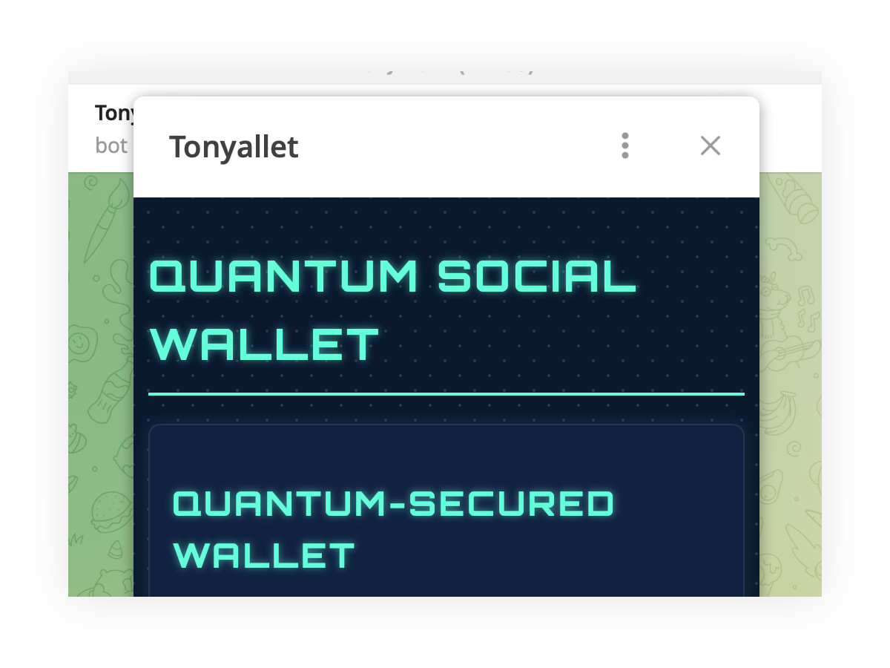
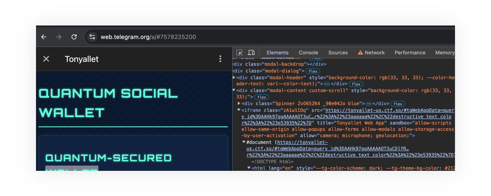
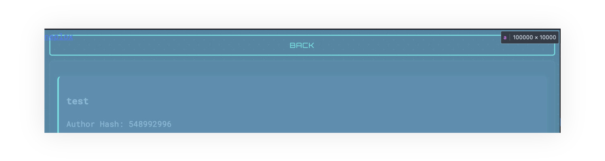
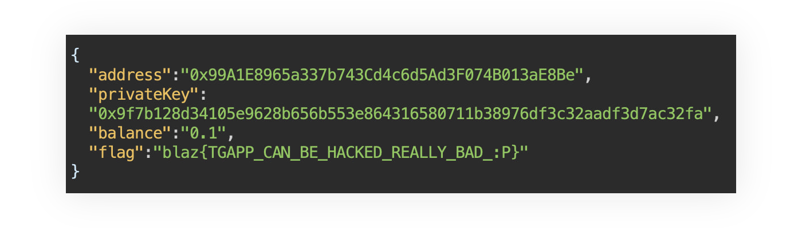

# Tonyallet

> [!NOTE]  
> Medium | 29 solves  
> Source: https://github.com/fuzzland/blazctf-2024/tree/main/tonyallet

Tonyallet was a classic Web2 CTF challenge released at the start of BlazCTF.
It mentioned a telegram bot in the description, and a website which can be used to
"report" specific posts to an admin bot. Usually, this means that the challenge
requires some form of browser client-side exploitation in order to leak the flag
from the Selenium/Puppeteer-based browser bot.

> Tony Ads #2 After his DeFi dreams crashed, Tony pivoted to SocialFi, crafting a buzzword-laden pitch that had VCs practically throwing money at him, all while he secretly chuckled at the irony of his newfound success.  
> Ping @tonyalletbot on Telegram! You can also report posts at https://tonyallet-us-report.ctf.so/

## Analysis

The challenge authors graciously provide us with a document describing the bots actions and our goal:

> Get the flag when you have at least 0.1ETH on Tony’s Quantum Social Network in your wallet!
> Bot performs the following actions:
>
> 1. Visits the shared post page;
> 2. Clicks the "back" button;
> 3. Reopens the Telegram web app and copies the wallet address;
> 4. Transfers 0.1ETH to the copied wallet address.

This gives us a pretty good idea of what we need to do: somehow get our wallet address
to be displayed on the page instead of the bot's, and then we'll be able to get 0.1ETH
transferred to us. There's no other way to get any balance on our account since the
chain network is hosted completely locally on the challenge server.

`@tonyalletbot` allows us to open the web app, implemented using Telegram's web Mini Apps
(https://core.telegram.org/bots/webapps):



Telegram web apps are simply web pages with a special JavaScript SDK embedded (https://telegram.org/js/telegram-web-app.js). To open this page in a normal browser window, we can copy its address from the `iframe` src attribute if
we open the mini app in the web Telegram version (https://web.telegram.org):
https://tonyallet-us.ctf.so.
The app allows creating posts and opening them in a new window,
without any fluff which would allow us to easily solve the challenge.



Lets now look at the admin bot's logic, the source code of which is provided
by the authors and written in Python, and pretty much resembles what was specified in the document mentioned above:

1. It will go to the given `post_id` page.
   ```python
        selenium_obj.get(f"{host}/post?id={post_id}")
   ```
2. It will click the button at the top of the screen to go back.
   ```python
    screen_width = selenium_obj.execute_script("return window.screen.width;")
    ActionChains(selenium_obj) \
        .move_by_offset(screen_width / 2, 10) \
        .click() \
        .perform()
   ```
3. It will open the main page with its Telegram data. We aren't given the
   web app backend source code, but know from the network requests made by
   the mini app that this data is used to authenticate the user, and the
   wallet address generated by the backend depends on it.
   ```python
    selenium_obj.get(f"{host}/#tgWebAppData=" + open("tgWebApp.txt").read())
   ```
4. It will copy the wallet address and transfer 0.1ETH to it. It might look
   like command injection might be possible here, but the wallet address
   is validated by a regex, so we can't actually achieve RCE.
   ```python
    wallet_address = selenium_obj.find_element(By.ID, "walletAddress").text
    if not re.match(r"^0x[a-fA-F0-9]{40}$", wallet_address):
        return "Failed to get wallet address"
    # send 0.1 ether to the wallet address
    os.system(f"cast send --private-key {os.getenv('PRIVATE_KEY')} {wallet_address} --value 0.1ether --rpc-url {os.getenv('RPC_URL')}")
   ```

Since we now know exactly how the bot tries to get the wallet address,
lets analyze the mini app main page source code to see if we can somehow manipulate it.
The `getWallet` function is called on window load without any arguments
to retrieve the address on the page, meaning that `bypass` will be false,
and the wallet address will be first checked in `localStorage`,
and only then fetched from the server if not found.

```js
async function getWallet(bypass = false) {
  let localAddress = localStorage.getItem("walletAddress");
  if (localAddress && !bypass) {
    // bypass is not specified during window init,
    // so the saved address will be used if found
    document.getElementById("walletAddress").textContent = localAddress;
    return;
  }

  try {
    const response = await fetch(`/wallet`, {
      method: "GET",
      headers: {
        Authorization: tg.initData, // this comes from the tgWebAppData value
      },
    });
    const data = await response.json();
    document.getElementById("walletAddress").textContent = data.address;
    localStorage.setItem("walletAddress", data.address);
  } catch (error) {
    console.error("Error fetching wallet:", error);
    alert("Failed to generate wallet. Please try again.");
  }
}
```

Therefore, in order to substitute the address, we just need to open the main page with our `tgWebAppData` before the admin does, our data will be used to retrieve our wallet address
from the server, and it will then be displayed on the main page once the bot opens it again.

What's left is to find a way to perform a redirect or window load from our post page.
If we look at the source code of the post page, we can see that it inserts the description of our post into the HTML, but only after sanitizing it with the latest version of `DOMPurify` (https://github.com/cure53/DOMPurify):

```js
postDetails.innerHTML = DOMPurify.sanitize(
  `
    <h3>${data.title}</h3>
    <p>${data.content}</p>
    <p>Author Hash: ${data.author}</p>
    <p>Timestamp: ${new Date().toISOString()}</p>
  `,
  { USE_PROFILES: { html: true } }
);
```

This prevents us from easily performing an XSS attack, but, as we already know, it isn't required.
We know that after the post page is opened, the admin bot will click at the top of it,
expecting the "Back" button to be located there.
In its standard configuration, however, `DOMPurify` does not remove inline styles from elements,
which allows us to create an HTML tag that occupies the entire page.
By using the z-index style, we can place it above all other tags so that the bot clicks on it instead of the "Back" button as expected:

```html
<a
  style="position: absolute;z-index:99999;left:0;top:0;width:100000px;height:10000px"
  href="//neplox.neplox"
  >neplox</a
>
```

Since the `href` attribute is also not sanitized in any way, we can use it to redirect
to any URL, including the mini app page with our own `tgWebAppData` value.

## Solution

Summarizing, we need to:

1. Open @tonyalletbot in Telegram's web version in order to copy our `tgWebAppData` value.
2. Add a new post with the following content, replacing `tgWebAppData` with the value copied from the `iframe` src attribute:

   ```html
   <a
     style="position: absolute;z-index:99999;left:0;top:0;width:100000px;height:10000px"
     href="https://tonyallet-us.ctf.so/#tgWebAppData=YOUR_DATA"
     >neplox</a
   >
   ```

   If you check the post at `https://tonyallet-us.ctf.so/post?id=YOUR_POST_ID`, you should see that our forged button fills the entire page.
   

3. Send the post ID to the admin bot via the report page linked in the challenge description.
4. Wait until the admin bot visits the malicious post and sends us 0.1ETH.
5. Check the response from the `/wallet` route on our mini app web page to get the flag 🚩🎉:


