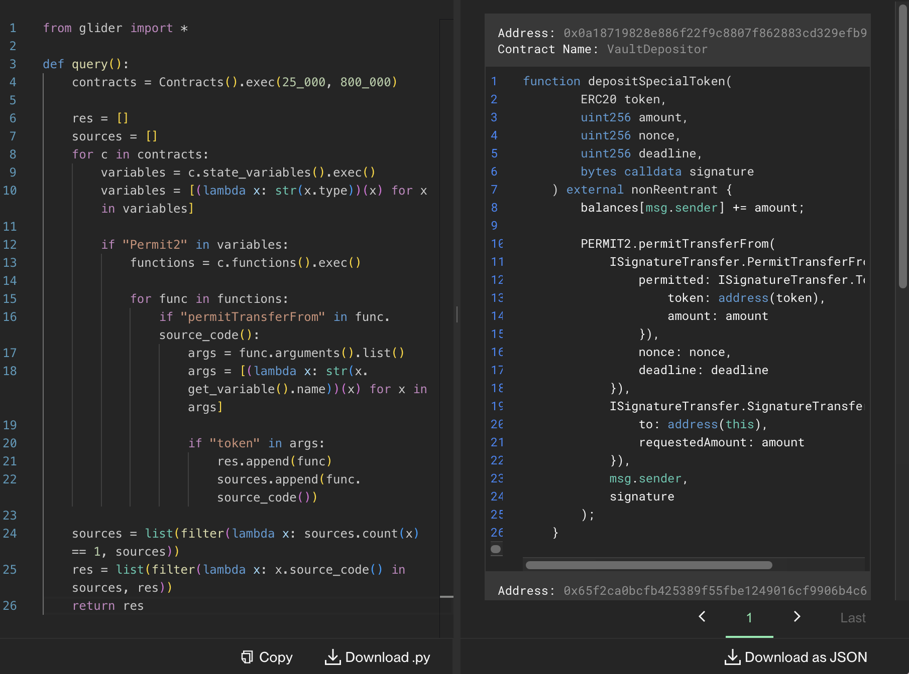

# Et tu, Permit2?

> [!NOTE]  
> \[🟢]&ensp;**EASY**:&emsp;`19` solves

<br />

"Et tu, Permit2?" was an **easy**-difficulty challenge released at the beginning of the **RemedyCTF**. It was one of the tasks related to the `Glider` category, designed to be solved using [Glider](https://glide.r.xyz/) by writing queries on the Kovan testnet. <br/><br/> Its description tells participants to find _one contract_ related to a _series of contracts_ developed to transfer tokens, whose author used _Uniswap’s_ `Permit2` _library_ incorrectly.

<br />

> Little Billy late one evening wrote and deployed a series of contracts that use Uniswap’s Permit2 library to transfer tokens. The next day, after learning more about Permit2, Billy discovered that one of his contracts had a security vulnerability caused by incorrect usage of the Uniswap Permit2 library.

<br />

## 🔍&ensp;Analysis

We created the following check-list, which is based off the task description, examples of similar contracts found online and common issues, and tested all of the Konvan testnet contracts against it:

- [x] Contract's name contains substrings `Vault` or `Permit`?
- [x] Contract has a variable with `Permit` substring in its name?
- [x] Contract has a variable of a `Permit2` type?
- [x] Functions include the substring `permitTransferFrom`?
- [x] Functions include the substring `permitWitnessTransferFrom`?
- [x] Contract is unique? Since only the one of the series of contracts is vulnerable

<br />

Examples of similar contracts and common issues:

- [Github search query:&ensp;`"permit2.permitTransferFrom" path:*.sol`](https://github.com/search?q=%22permit2.permitTransferFrom%22+path%3A*.sol&type=code)
- [`useful-solidity-patterns` `Permit2Vault` contract](https://github.com/dragonfly-xyz/useful-solidity-patterns/blob/main/patterns/permit2/Permit2Vault.sol)

<br />

## 🔓&ensp;Solution

### Glider query 🛩

An example of the [Glider](https://glide.r.xyz/) query that can help solve the task:

```python
from glider import *

def query():
    contracts = Contracts().exec(25_000, 800_000)

    res = []
    sources = []
    for c in contracts:
        variables = c.state_variables().exec()
        variables = [(lambda x: str(x.type))(x) for x in variables]

        if "Permit2" in variables:
            functions = c.functions().exec()

            for func in functions:
                if "permitTransferFrom" in func.source_code():
                    args = func.arguments().list()
                    args = [(lambda x: str(x.get_variable().name))(x) for x in args]

                    if "token" in args:
                        res.append(func)
                        sources.append(func.source_code())

    sources = list(filter(lambda x: sources.count(x) == 1, sources))
    res = list(filter(lambda x: x.source_code() in sources, res))
    return res
```

The result of the query returned by [Glider](https://glide.r.xyz/):

<p align="center"></p>

### Target contract 📜

Even though the target contract's name implies it is designed to be used to deposit some _Special Token_, turns out the developer of the target smart contract allows anyone to pass any `ERC20 token`, which nevertheless counts as a _Special Token_ and affects the balances of it (`balances[msg.sender] += amount`).
<br />

Here is the source code of the target contract which participants had to find:

```solidity
contract VaultDepositor {
    bool private _reentrancyGuard;
    Permit2 public immutable PERMIT2;
    mapping (address => uint256) public balances;

    constructor(Permit2 permit_) {
        PERMIT2 = permit_;
    }

    modifier nonReentrant() {
        require(!_reentrancyGuard, 'no reentrancy');
        _reentrancyGuard = true;
        _;
        _reentrancyGuard = false;
    }

    function depositSpecialToken(
        ERC20 token,
        uint256 amount,
        uint256 nonce,
        uint256 deadline,
        bytes calldata signature
    ) external nonReentrant {
        balances[msg.sender] += amount;

        PERMIT2.permitTransferFrom(
            ISignatureTransfer.PermitTransferFrom({
                permitted: ISignatureTransfer.TokenPermissions({
                    token: address(token),
                    amount: amount
                }),
                nonce: nonce,
                deadline: deadline
            }),
            ISignatureTransfer.SignatureTransferDetails({
                to: address(this),
                requestedAmount: amount
            }),
            msg.sender,
            signature
        );
    }
}
```

<br />

## 📑 See also

- \[ 📘 \]&emsp;**Documentation**:&ensp;‟Permit2 SignatureTransfer Reference” by Uniswap&ensp;[🔗](https://docs.uniswap.org/contracts/permit2/reference/signature-transfer#security-considerations)
- \[ 📗 \]&emsp;**Article**:&ensp;‟How to Implement Permit2” by Cyfrin&ensp;[🔗](https://www.cyfrin.io/blog/how-to-implement-permit2)
- \[ 📗 \]&emsp;**Article**:&ensp;‟WETH Permit Hack (Solidity Code Example)” by Cyfrin&ensp;[🔗](https://www.cyfrin.io/glossary/weth-permit-hack-solidity-code-example)
- \[ 📗 \]&emsp;**Article**:&ensp;‟How to implement Uniswap Permit2 in your protocol” by GASPERPRE&ensp;[🔗](https://gasperpre.com/how-to-implement-uniswap-permit2-in-your-protocol)
