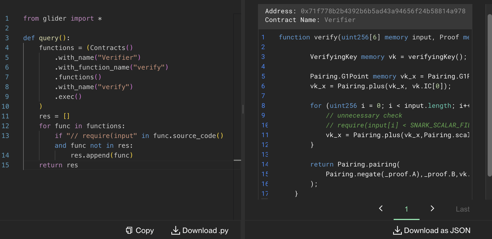

# Maybe it's unnecessary?

> [!NOTE]  
> \[🟢]&ensp;**EASY**:&emsp;`20` solves

<br />

"Maybe it's unnecessary?" was an **easy**-difficulty challenge released in the midst of the **RemedyCTF**. It was one of the tasks related to the `Glider` category, designed to be solved using [Glider](https://glide.r.xyz/) by writing queries on the Kovan testnet. <br/><br/> Its description tells participants to find a _SNARK verifier_ contract, whose author did not implement any _input checks_.

<br />

> Once upon a time, a SNARK verifier contract decided to skip an input check. "Maybe it's unnecessary," they thought. "Or maybe it's just for gas optimization!"<br><br>
> But what if it wasn’t? Find the contract with the missing check and see why that “unnecessary” part might actually be the most important one.

<br />

## 🔍&ensp;Analysis

We created the following check-list, which is based off the task description, examples of similar contracts found online and common issues, and tested all of the Konvan testnet contracts against it:

- [x] Contract's name equals to `Verifier`?
- [x] Contract's name contains substrings `SNARK` or `Verifier`?
- [x] Contract has a variable with `SNARK` substring in its name?
- [x] Contract has a `SNARK_SCALAR_FIELD` variable?
- [x] Contract has a `verify` function?
- [x] Contract has a `verifyProof` function?
- [x] Contract has a `verifyingKey` function?
- [x] Functions do not include the substring `require(input`?
- [x] Functions include the substring `// require(input`?

<br />

Examples of similar contracts and common issues:

- [Github search query:&ensp;`"contract Verifier" "SNARK" path:*.sol`](https://github.com/search?q=%22contract%20Verifier%22%20%22SNARK%22%20path%3A*.sol&type=code)
- [Github search query:&ensp;`"contract Verifier" "SNARK_SCALAR_FIELD" path:*.sol`](https://github.com/search?q=%22contract+Verifier%22+%22SNARK_SCALAR_FIELD%22+path%3A*.sol&type=code)
- [`baseline` `Verifier` contract](https://github.com/ethereum-oasis-op/baseline/blob/main/examples/battleship/server/contracts/Verifier.sol)
- [`semaphore` Issue `#90`:&ensp;Missing checks to ensure zk proof inputs are less than SNARK_SCALAR_FIELD](https://github.com/semaphore-protocol/semaphore/issues/90)

<br />

## 🔓&ensp;Solution

### Glider query 🛩

An example of the [Glider](https://glide.r.xyz/) query that can help solve the task:

```python
from glider import *

def query():
    functions = (Contracts()
        .with_name("Verifier")
        .with_function_name("verify")
        .functions()
        .with_name("verify")
        .exec()
    )
    res = []
    for func in functions:
        if "// require(input" in func.source_code() and func not in res:
            res.append(func)
    return res
```

The result of the query returned by [Glider](https://glide.r.xyz/):

<p align="center"></p>

### Target contract 📜

Turns out the developer of the target smart contract commented out the `require(input[i] < SNARK_SCALAR_FIELD,\"verifier-gte-snark-scalar-field\");` line of the `verify` function.
<br />

Here is the source code of the target contract which participants had to find:

```solidity
contract Verifier {
    uint256 constant SNARK_SCALAR_FIELD = 21888242871839275222246405745257275088548364400416034343698204186575808495617;
    uint256 constant PRIME_Q = 21888242871839275222246405745257275088696311157297823662689037894645226208583;
    using Pairing for *;

    struct VerifyingKey {
        Pairing.G1Point alfa1;
        Pairing.G2Point beta2;
        Pairing.G2Point gamma2;
        Pairing.G2Point delta2;
        Pairing.G1Point[7] IC;
    }

    struct Proof {
        Pairing.G1Point A;
        Pairing.G2Point B;
        Pairing.G1Point C;
    }

    function verifyingKey() internal pure returns (VerifyingKey memory vk) {
        vk.alfa1 = Pairing.G1Point(uint256(20692898189092739278193869274495556617788530808486270118371701516666252877969),uint256(11713062878292653967971378194351968039596396853904572879488166084231740557279));
        vk.beta2 = Pairing.G2Point([uint256(12168528810181263706895252315640534818222943348193302139358377162645029937006),uint256(281120578337195720357474965979947690431622127986816839208576358024608803542)],[uint256(16129176515713072042442734839012966563817890688785805090011011570989315559913),uint256(9011703453772030375124466642203641636825223906145908770308724549646909480510)]);
        vk.gamma2 = Pairing.G2Point([uint256(11559732032986387107991004021392285783925812861821192530917403151452391805634),uint256(10857046999023057135944570762232829481370756359578518086990519993285655852781)],[uint256(4082367875863433681332203403145435568316851327593401208105741076214120093531),uint256(8495653923123431417604973247489272438418190587263600148770280649306958101930)]);
        vk.delta2 = Pairing.G2Point([uint256(21280594949518992153305586783242820682644996932183186320680800072133486887432),uint256(150879136433974552800030963899771162647715069685890547489132178314736470662)],[uint256(1081836006956609894549771334721413187913047383331561601606260283167615953295),uint256(11434086686358152335540554643130007307617078324975981257823476472104616196090)]);
        vk.IC[0] = Pairing.G1Point(uint256(16225148364316337376768119297456868908427925829817748684139175309620217098814),uint256(5167268689450204162046084442581051565997733233062478317813755636162413164690));
        vk.IC[1] = Pairing.G1Point(uint256(12882377842072682264979317445365303375159828272423495088911985689463022094260),uint256(19488215856665173565526758360510125932214252767275816329232454875804474844786));
        vk.IC[2] = Pairing.G1Point(uint256(13083492661683431044045992285476184182144099829507350352128615182516530014777),uint256(602051281796153692392523702676782023472744522032670801091617246498551238913));
        vk.IC[3] = Pairing.G1Point(uint256(9732465972180335629969421513785602934706096902316483580882842789662669212890),uint256(2776526698606888434074200384264824461688198384989521091253289776235602495678));
        vk.IC[4] = Pairing.G1Point(uint256(8586364274534577154894611080234048648883781955345622578531233113180532234842),uint256(21276134929883121123323359450658320820075698490666870487450985603988214349407));
        vk.IC[5] = Pairing.G1Point(uint256(4910628533171597675018724709631788948355422829499855033965018665300386637884),uint256(20532468890024084510431799098097081600480376127870299142189696620752500664302));
        vk.IC[6] = Pairing.G1Point(uint256(15335858102289947642505450692012116222827233918185150176888641903531542034017),uint256(5311597067667671581646709998171703828965875677637292315055030353779531404812));

    }

    function verify(uint256[6] memory input, Proof memory _proof) internal view returns(bool){

        VerifyingKey memory vk = verifyingKey();

        Pairing.G1Point memory vk_x = Pairing.G1Point(0,0);
        vk_x = Pairing.plus(vk_x, vk.IC[0]);

        for (uint256 i = 0; i < input.length; i++) {
            // unnecessary check
            // require(input[i] < SNARK_SCALAR_FIELD,\"verifier-gte-snark-scalar-field\");
            vk_x = Pairing.plus(vk_x,Pairing.scalar_mul(vk.IC[i + 1],input[i]));
        }

        return Pairing.pairing(
            Pairing.negate(_proof.A),_proof.B,vk.alfa1,vk.beta2,vk_x,vk.gamma2,_proof.C,vk.delta2
        );
    }

    function verifyProof(
        bytes memory proof,uint256[6] memory input
    ) public view returns (bool) {
        uint256[8] memory p = abi.decode(proof,(uint256[8]));

        for (uint8 i = 0; i < p.length; i++) {
            require(p[i] < PRIME_Q,\"verifier-proof-element-gte-prime-q\");
        }

        Proof memory _proof;
        _proof.A = Pairing.G1Point(p[0],p[1]);
        _proof.B = Pairing.G2Point([p[2],p[3]],[p[4],p[5]]);
        _proof.C = Pairing.G1Point(p[6],p[7]);

        return verify(input, _proof);
    }
}
```

<br />

## 📑 See also

- \[ 📗 \]&emsp;**Article**:&ensp;‟Exploring Vulnerabilities: The zkSNARK Malleability Attack on the Groth16 Protocol” by Crypto Fairy&ensp;[🔗](https://medium.com/@cryptofairy/exploring-vulnerabilities-the-zksnark-malleability-attack-on-the-groth16-protocol-8c80d13751c5)
