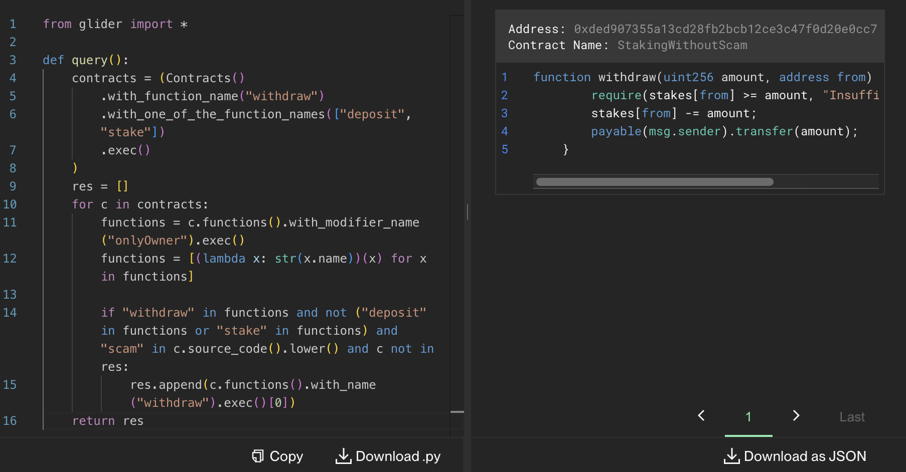

# "memorable" onlyOwner

> [!NOTE]  
> \[🟢] **EASY**: `10` solves

<br />

"memorable" onlyOwner was an **easy**-difficulty challenge released in the midst of the **RemedyCTF**. It was one of the tasks related to the `Glider` category, designed to be solved using [Glider](https://glide.r.xyz/) by writing queries on the Kovan testnet. <br/><br/> Its description tells participants to find a contract with a `deposit` _function_ and a `withdraw` _function_ with an `onlyOwner` _modifier_, whose author forgot something crucial, but swears it is not a _scam_.

<br />

> In the world of smart contracts, developers sometimes make mistakes—some small, some... well, let’s say “memorable”. A developer wrote an onlyOwner modifier but forgot something crucial.<br><br>
> The contract lets anyone deposit, but only the owner is supposed to withdraw. Sounds safe, right? Of course, this isn’t a scam, we swear! But with that one critical part is missing, things aren’t as secure as they should be.<br><br>
> Can you find the contract where this simple but critical mistake slipped through the cracks?

<br />

## 🔍&ensp;Analysis

We created the following check-list, which is based off the task description, and tested all of the Konvan testnet contracts against it:

- [x] Contract's name contains a substring `Scam`?
- [x] Contract has a variable of a `memory` type?
- [x] Contract has a `withdraw` function?
- [x] Contract has a `deposit` function?
- [x] Contract has a `stake` function?
- [x] Contract does not have an `onlyOwner` modifier?
- [x] `withdraw` function has an `onlyOwner` modifier?
- [x] `deposit` function does not have an `onlyOwner` modifier?
- [x] `stake` function does not have an `onlyOwner` modifier?
- [x] Functions include the substring `scam`?

<br />

## 🔓&ensp;Solution

### Glider query 🛩

An example of the [Glider](https://glide.r.xyz/) query that can help solve the task:

```python
from glider import *

def query():
    contracts = (Contracts()
        .with_function_name("withdraw")
        .with_one_of_the_function_names(["deposit", "stake"])
        .exec()
    )
    res = []
    for c in contracts:
        functions = c.functions().with_modifier_name("onlyOwner").exec()
        functions = [(lambda x: str(x.name))(x) for x in functions]

        if "withdraw" in functions and not ("deposit" in functions or "stake" in functions) and "scam" in c.source_code().lower() and c not in res:
            res.append(c.functions().with_name("withdraw").exec()[0])
    return res
```

The result of the query returned by [Glider](https://glide.r.xyz/):

<p align="center"></p>

### Target contract 📜

The target contract has a `stake` function that can be called by anyone and a `withdraw` function which is supposed to be called only by the owner due to the `onlyOwner` modifier.
<br />

Here is the source code of the target contract which participants had to find:

```solidity
contract StakingWithoutScam is Ownable{
    mapping(address => uint256) public stakes;

    // STAKE TO ERAN A LOT OF MONEY
    function stake() external payable {
        require(msg.value > 0, \"Must stake some ETH\");
        stakes[msg.sender] += msg.value;
    }

    // IT'S NOT A SCAM I SWARE!!!!
    function withdraw(uint256 amount, address from) external onlyOwner {
        require(stakes[from] >= amount, \"Insufficient balance\");
        stakes[from] -= amount;
        payable(msg.sender).transfer(amount);
    }

    function getStakedAmount() external view returns (uint256) {
        return stakes[msg.sender];
    }

    receive() external payable {}
}
```

<br />

## 📑 See also

- \[ 📘 \]&emsp;**Documentation**:&ensp;‟Soliditylang: Common Patterns”&ensp;[🔗](https://docs.soliditylang.org/en/latest/common-patterns.html)
- \[ 📘 \]&emsp;**Documentation**:&ensp;‟Soliditylang: Security Considerations”&ensp;[🔗](https://docs.soliditylang.org/en/latest/security-considerations.html)
