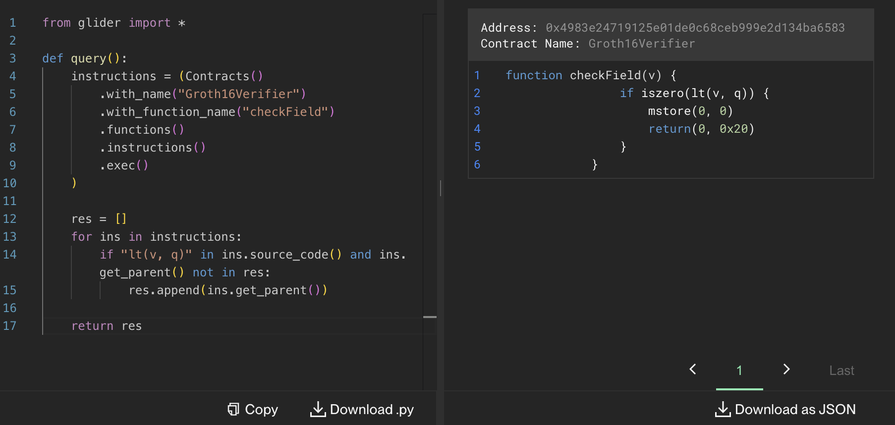

# R vs Q

> [!NOTE]  
> \[🟢]&ensp;**EASY**:&emsp;`36` solves

<br />

"R vs Q" was an **easy**-difficulty challenge released in the midst of the **RemedyCTF**. It was one of the tasks related to the `Glider` category, designed to be solved using [Glider](https://glide.r.xyz/) by writing queries on the Kovan testnet. <br/><br/> Its description tells participants to find the `Groth16Verifier` contract, whose author mixed up a _Scalar Field_ (`r`) with a _Base Field_ (`q`).

<br />

> Do you know what a Groth16 SNARK verifier is? Great! Then you also know the difference between a Scalar Field and a Base Field right?<br><br>
> Now, find the Groth16Verifier contract where the developer clearly doesn’t!

<br />

## 🔍&ensp;Analysis

We created the following check-list, which is based off the task description, examples of similar contracts found online and common issues, and tested all of the Konvan testnet contracts against it:

- [x] Contract's name equals to `Groth16Verifier`?
- [x] Contract's name contains substrings `Groth` or `Verifier`?
- [x] Contract has a `checkField` function?
- [x] Contract has a `verifyProof` function?
- [x] `checkField` function includes the line `iszero(lt(v, q))`?

<br />

Examples of similar contracts and common issues:

- [Github search query:&ensp;`"contract Groth16Verifier" path:*.sol`](https://github.com/search?q=%22contract+Groth16Verifier%22+path%3A*.sol&type=code)
- [`snarkjs` `Groth16Verifier` contract](https://github.com/iden3/snarkjs/blob/master/templates/verifier_groth16.sol.ejs)
- [`snarkjs` Issue `#479`:&ensp;Why check public signals less than q instead of r in generated solidity code?](https://github.com/iden3/snarkjs/issues/479)
- [`snarkjs` Fix `#480`:&ensp;Groth16Verifier solidity scalar size check. (security vulnerability)](https://github.com/iden3/snarkjs/pull/480)

<br />

## 🔓&ensp;Solution

### Glider query 🛩

An example of the [Glider](https://glide.r.xyz/) query that can help solve the task:

```python
from glider import *

def query():
    instructions = (Contracts()
        .with_name("Groth16Verifier")
        .with_function_name('checkField')
        .functions()
        .instructions()
        .exec(10_000)
    )

    res = []
    for ins in instructions:
        if "lt(v, q)" in ins.source_code() and ins.get_parent() not in res:
            res.append(ins.get_parent())

    return res
```

The result of the query returned by [Glider](https://glide.r.xyz/):

<p align="center"></p>

### Target contract 📜

Indeed, turns out the vulnerability included in the target contract is the same as [the one reported to the SnarkJS](https://github.com/iden3/snarkjs/issues/479):&ensp;`iszero(lt(v, q))` condition check within the `checkField` function checks the _Base Field_ (`q`) instead of the _Scalar Field_ (`r`).
<br />

Here is the source code of the target contract which participants had to find:

```solidity
contract Groth16Verifier {
    // Scalar field size
    uint256 constant r    = 21888242871839275222246405745257275088548364400416034343698204186575808495617;
    // Base field size
    uint256 constant q   = 21888242871839275222246405745257275088696311157297823662689037894645226208583;

    // Verification Key data
    uint256 constant alphax  = 20491192805390485299153009773594534940189261866228447918068658471970481763042;
    uint256 constant alphay  = 9383485363053290200918347156157836566562967994039712273449902621266178545958;
    uint256 constant betax1  = 4252822878758300859123897981450591353533073413197771768651442665752259397132;
    uint256 constant betax2  = 6375614351688725206403948262868962793625744043794305715222011528459656738731;
    uint256 constant betay1  = 21847035105528745403288232691147584728191162732299865338377159692350059136679;
    uint256 constant betay2  = 10505242626370262277552901082094356697409835680220590971873171140371331206856;
    uint256 constant gammax1 = 11559732032986387107991004021392285783925812861821192530917403151452391805634;
    uint256 constant gammax2 = 10857046999023057135944570762232829481370756359578518086990519993285655852781;
    uint256 constant gammay1 = 4082367875863433681332203403145435568316851327593401208105741076214120093531;
    uint256 constant gammay2 = 8495653923123431417604973247489272438418190587263600148770280649306958101930;
    uint256 constant deltax1 = 7537613082883539239998105689980695625949864158911233083307240523481447029201;
    uint256 constant deltax2 = 18425422419094349166845299166446400283955610392693002196033474730898100891393;
    uint256 constant deltay1 = 9734737963690957740179121580228276788359472364486142941618892845265550985341;
    uint256 constant deltay2 = 19424219928877642960622596960718531292261548324721236723020030007333427710256;


    uint256 constant IC0x = 6902718247877772411363845861177050309258223353503700050311359326150519336692;
    uint256 constant IC0y = 15825279453398516401265572637576445394013091560186110937875220954546679110159;

    uint256 constant IC1x = 2335804858433576387747825582160359354916267733138827948973385608187184828569;
    uint256 constant IC1y = 5736008506642285963655345198014496364551739958976504633673791816202163044118;

    uint256 constant IC2x = 6269455652562704144793722062373279568471767955901279627797463015040136088132;
    uint256 constant IC2y = 2097530588191744967177200393826023428699458382295316095274264671302200006698;

    uint256 constant IC3x = 9822862276973085434476438868692851322487547916783049654593145248962644277643;
    uint256 constant IC3y = 13358026137961492797393341724052128319258593462853360012627607362475815103442;

    uint256 constant IC4x = 14719148997270446956997289375593821114034084437550001883662517657000734282586;
    uint256 constant IC4y = 1998224198671702911531451107100115167770885039941574729645701907241412776308;

    uint256 constant IC5x = 359894349223066781310974365307972581164914770698407647854073977658157147230;
    uint256 constant IC5y = 4226113369443688791926415338604034925838584747992607214489363181365627308608;

    uint256 constant IC6x = 8131352830647874407773009521188360590887607801163495436549679220199551501178;
    uint256 constant IC6y = 2496366191763335194055513493653718797330181861495912467368843578731618007027;

    uint256 constant IC7x = 5324791436169324680862288927376094103624123876195563861346513574577173643567;
    uint256 constant IC7y = 10539632294755752334066059856447171990510491871168341570429569842426314117653;

    uint256 constant IC8x = 21398838651908546916551334433437076903885176753396417385115556979686206468251;
    uint256 constant IC8y = 2283165388441295638775771203114643615346617529992451266709724264297809953544;

    uint256 constant IC9x = 16450282086321400334368283708403499847573182040077819178856321188442820130414;
    uint256 constant IC9y = 20227982940527385555692156484806747209260038014579804010296344969319860246613;

    uint256 constant IC10x = 1416849092724586759478061558363222409117668509275228664731118821895695167480;
    uint256 constant IC10y = 14279591006307641048883156401797861581231631415414897920853119376578010808716;

    uint256 constant IC11x = 10972046352748637769234591589921324542843146653569482848432798172628944437256;
    uint256 constant IC11y = 13951850916181885013998871924877530212665252857591601803360542322172843954667;

    uint256 constant IC12x = 10475342243781351585273160940612655577727791739250775206756870040352542452664;
    uint256 constant IC12y = 5139068014462344879213636708300130277178459139177464895691208627008733872682;


    // Memory data
    uint16 constant pVk = 0;
    uint16 constant pPairing = 128;

    uint16 constant pLastMem = 896;

    function verifyProof(uint[2] calldata _pA, uint[2][2] calldata _pB, uint[2] calldata _pC, uint[12] calldata _pubSignals) public view returns (bool) {
        assembly {
            function checkField(v) {
                if iszero(lt(v, q)) {
                    mstore(0, 0)
                    return(0, 0x20)
                }
            }

            // G1 function to multiply a G1 value(x,y) to value in an address
            function g1_mulAccC(pR, x, y, s) {
                let success
                let mIn := mload(0x40)
                mstore(mIn, x)
                mstore(add(mIn, 32), y)
                mstore(add(mIn, 64), s)

                success := staticcall(sub(gas(), 2000), 7, mIn, 96, mIn, 64)

                if iszero(success) {
                    mstore(0, 0)
                    return(0, 0x20)
                }

                mstore(add(mIn, 64), mload(pR))
                mstore(add(mIn, 96), mload(add(pR, 32)))

                success := staticcall(sub(gas(), 2000), 6, mIn, 128, pR, 64)

                if iszero(success) {
                    mstore(0, 0)
                    return(0, 0x20)
                }
            }

            function checkPairing(pA, pB, pC, pubSignals, pMem) -> isOk {
                let _pPairing := add(pMem, pPairing)
                let _pVk := add(pMem, pVk)

                mstore(_pVk, IC0x)
                mstore(add(_pVk, 32), IC0y)

                // Compute the linear combination vk_x
                g1_mulAccC(_pVk, IC1x, IC1y, calldataload(add(pubSignals, 0)))
                g1_mulAccC(_pVk, IC2x, IC2y, calldataload(add(pubSignals, 32)))
                g1_mulAccC(_pVk, IC3x, IC3y, calldataload(add(pubSignals, 64)))
                g1_mulAccC(_pVk, IC4x, IC4y, calldataload(add(pubSignals, 96)))
                g1_mulAccC(_pVk, IC5x, IC5y, calldataload(add(pubSignals, 128)))
                g1_mulAccC(_pVk, IC6x, IC6y, calldataload(add(pubSignals, 160)))
                g1_mulAccC(_pVk, IC7x, IC7y, calldataload(add(pubSignals, 192)))
                g1_mulAccC(_pVk, IC8x, IC8y, calldataload(add(pubSignals, 224)))
                g1_mulAccC(_pVk, IC9x, IC9y, calldataload(add(pubSignals, 256)))
                g1_mulAccC(_pVk, IC10x, IC10y, calldataload(add(pubSignals, 288)))
                g1_mulAccC(_pVk, IC11x, IC11y, calldataload(add(pubSignals, 320)))
                g1_mulAccC(_pVk, IC12x, IC12y, calldataload(add(pubSignals, 352)))

                // -A
                mstore(_pPairing, calldataload(pA))
                mstore(add(_pPairing, 32), mod(sub(q, calldataload(add(pA, 32))), q))

                // B
                mstore(add(_pPairing, 64), calldataload(pB))
                mstore(add(_pPairing, 96), calldataload(add(pB, 32)))
                mstore(add(_pPairing, 128), calldataload(add(pB, 64)))
                mstore(add(_pPairing, 160), calldataload(add(pB, 96)))

                // alpha1
                mstore(add(_pPairing, 192), alphax)
                mstore(add(_pPairing, 224), alphay)

                // beta2
                mstore(add(_pPairing, 256), betax1)
                mstore(add(_pPairing, 288), betax2)
                mstore(add(_pPairing, 320), betay1)
                mstore(add(_pPairing, 352), betay2)

                // vk_x
                mstore(add(_pPairing, 384), mload(add(pMem, pVk)))
                mstore(add(_pPairing, 416), mload(add(pMem, add(pVk, 32))))

                // gamma2
                mstore(add(_pPairing, 448), gammax1)
                mstore(add(_pPairing, 480), gammax2)
                mstore(add(_pPairing, 512), gammay1)
                mstore(add(_pPairing, 544), gammay2)

                // C
                mstore(add(_pPairing, 576), calldataload(pC))
                mstore(add(_pPairing, 608), calldataload(add(pC, 32)))

                // delta2
                mstore(add(_pPairing, 640), deltax1)
                mstore(add(_pPairing, 672), deltax2)
                mstore(add(_pPairing, 704), deltay1)
                mstore(add(_pPairing, 736), deltay2)

                let success := staticcall(sub(gas(), 2000), 8, _pPairing, 768, _pPairing, 0x20)

                isOk := and(success, mload(_pPairing))
            }

            let pMem := mload(0x40)
            mstore(0x40, add(pMem, pLastMem))

            // Validate that all evaluations ∈ F
            checkField(calldataload(add(_pubSignals, 0)))
            checkField(calldataload(add(_pubSignals, 32)))
            checkField(calldataload(add(_pubSignals, 64)))
            checkField(calldataload(add(_pubSignals, 96)))
            checkField(calldataload(add(_pubSignals, 128)))
            checkField(calldataload(add(_pubSignals, 160)))
            checkField(calldataload(add(_pubSignals, 192)))
            checkField(calldataload(add(_pubSignals, 224)))
            checkField(calldataload(add(_pubSignals, 256)))
            checkField(calldataload(add(_pubSignals, 288)))
            checkField(calldataload(add(_pubSignals, 320)))
            checkField(calldataload(add(_pubSignals, 352)))
            checkField(calldataload(add(_pubSignals, 384)))

            // Validate all evaluations
            let isValid := checkPairing(_pA, _pB, _pC, _pubSignals, pMem)

            mstore(0, isValid)
            return(0, 0x20)
        }
    }
}
```
